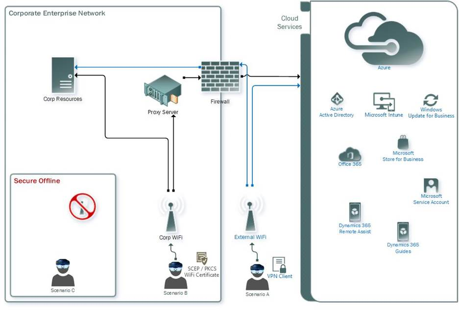

# Common Infrastructure Deployment Scenarios Overview

This following information provides a high-level architecture overview for three common scenarios when deploying and managing Microsoft HoloLens 2 devices within the enterprise. Often how you manage your devices and how access your organization's resources is largely determined by factors already in place. Based on the existing infrastructure we invite you to review the common device management style in the following scenarios, and try out our guides for deploying in the scenario matching your needs.

## Scenarios

The diagram below represents three typical scenarios for HoloLens 2 deployments.

### Scenario A: Deploy to cloud connect devices

HoloLens 2 is deployed for use primarily in environments external to a corporate network. Corporate resources are not accessed or may be limited through VPN. This  deployment is similar to managed mobile devices within a company.
 * Basic Common Configurations
   * Wi-Fi networks are typically fully open to the Internet and Cloud services.
   * Azure AD Join with MDM Auto Enrollment -- MDM (Intune) Managed
   * Users sign in with their own corporate account (Azure AD)
     * Single or multiple users per device supported
   * Varying levels of device lockdown configurations are applied based on specific use cases, from Fully Open to Single App Kiosk.
   * One or more applications are deployed via MDM

* Common Challenges
   * Determining which MDM configurations to apply to the HoloLens 2 based on scenario requirements.

For a deployment guide that is similar to this scenario review our guide for [Cloud connected HoloLens 2 with Remote Assist](hololens2-cloud-connected-overview.md).

> [!div class="nextstepaction"]
> [Deployment Guide – Cloud connected HoloLens 2 with Remote Assist](hololens2-cloud-connected-overview.md)

### Scenario B: Deploy inside your organization's network

HoloLens 2 is deployed for use primarily on the corporate network with access to internal corporate resources. Internet and cloud services may be limited. This deployment is a typical deployment for most Windows 10 PCs.
 * Basic Common Configurations
   * Wi-Fi network is an internal corporate network with access to internal resources, and limited access to the internet or Cloud services.
   * Azure AD Join with MDM Auto Enrollment
   * MDM (Intune) Managed
   * Users sign in with their own corporate account (Azure AD)
     * Single or multiple users per device supported
   * Varying levels of device lockdown configurations are applied based on specific use cases, from Fully Open to Single App Kiosk.
   * One or more applications are deployed via MDM

 * Common Challenges
   * HoloLens 2 does not support on premises AD join or SCCM. Only Azure AD join with MDM. Many companies today still deploy Windows 10 PCs in this scenario as on premises AD joined devices, managed by System Center Configuration Manager (SCCM) and may not have the infrastructure deployed/configured for managing internal Windows 10 devices via cloud-based MDM solutions.
   * As HoloLens 2 is a cloud first device, it relies heavily on internet and cloud connected services for User authentication, OS updates, MDM management, etc. When connecting to a corporate network, Proxy/Firewall rules will most likely need to be adjusted to enable access for HoloLens 2 and the applications that run on it.
   * Corporate Wi-Fi connectivity typically requires certificates to authenticate the device or user to the network. The required infrastructure or settings to deploy certificates to Windows 10 devices through MDM can be challenging to configure.

### Scenario C: Deploy in secure offline environment

HoloLens 2 is deployed for use primarily offline with no network or internet access. This is a typical deployment for highly secure or confidential locations.
 * Basic Common Configurations
   * Wi-Fi connectivity is disabled. Ethernet via USB may be enabled for LAN connectivity if required.
   * Not Managed.
   * Local user account for device sign in.
     * HoloLens 2 supports only one local account.
   * Varying levels of device lockdown configurations are applied via Provisioning Packages based on specific use cases. These configurations are typically very restricted due to secure environment requirements.
   * One or more applications are deployed via Provisioning Package

 * Common Challenges
   * There is a limited set of configurations available through Provisioning Packages
   * Cloud services are not able to be leveraged, therefore limiting the HoloLens 2 capabilities.
   * Higher administrative overhead since these devices have to be setup, configured, and updated manually.

For a deployment guide that is similar to this scenario review our [Offline Secure Deployment Guide](hololens-common-scenarios-offline-secure.md).

> [!div class="nextstepaction"]
> [Deployment Guide – Offline Secure HoloLens 2](hololens-common-scenarios-offline-secure.md)
