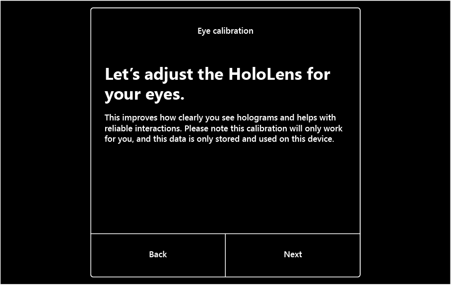
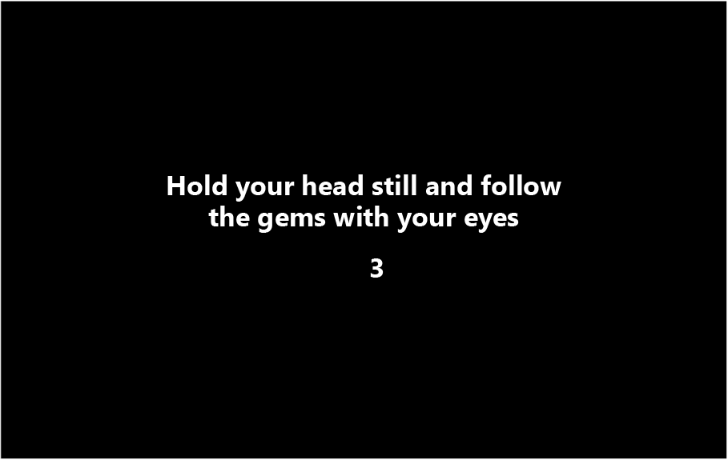
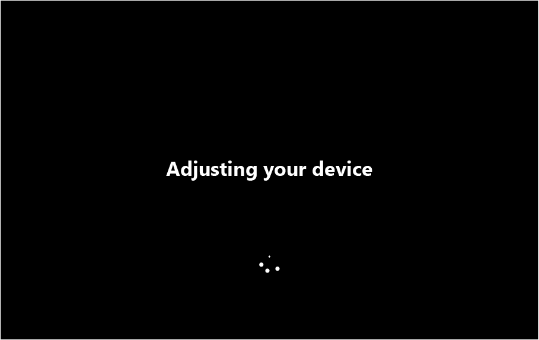
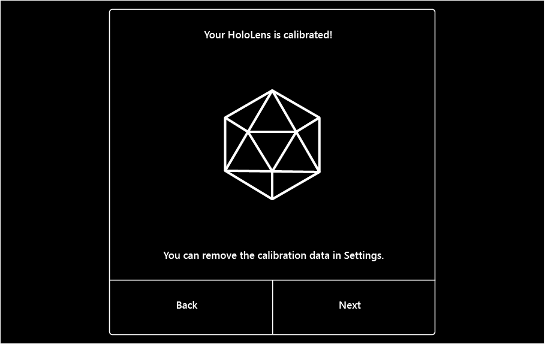
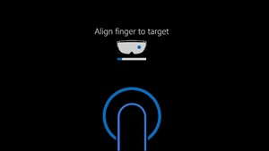
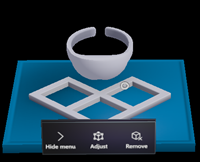

# Improve visual quality and comfort

HoloLens 2 and HoloLens (1st gen) both work better when they're calibrated to your unique eyes.

While both devices need to calibrate for the best hologram viewing experience, they use different calibration technologies and techniques.  Jump to [HoloLens 2 calibration](#calibrating-your-hololens-2) or [HoloLens (1st gen) calibration](#calibrating-your-hololens-1st-gen).

## Calibrating your HoloLens 2

HoloLens 2 uses eye-tracking technology to improve your experience seeing and interacting with the virtual environment. Calibrating the HoloLens 2 ensures that it can accurately track your eyes (and the eyes of anyone else who uses the device). It also helps with user comfort, hologram alignment, and hand tracking. After calibration, holograms will appear correctly even as the visor shifts on your head.

HoloLens 2 prompts a user to calibrate the device under the following circumstances:

- The user is using the device for the first time
- The user previously opted out of the calibration process
- The calibration process didn't succeed the last time the user used the device
- The user has deleted their calibration profiles
- The device is taken off and puts back on and any of the above circumstances apply 

During this process, you'll look at a set of targets (gems). It's fine if you blink during calibration, but try to stay focused on the gems instead of other objects in the room.  Focusing on the gems allows HoloLens to learn about your eye position to render your holographic world.

If calibration was successful, you'll see a success screen.  If not, read more about [diagnosing calibration failures](hololens-troubleshooting.md#troubleshooting-hololens-2-calibration).

### Calibration when sharing a device or session

Multiple users can share a HoloLens 2 device, without a need for each person to go through device setup. When a new user puts the device on their head for the first time, HoloLens 2 automatically prompts the user to calibrate visuals. When a user that has previously calibrated visuals puts the device on their head, the display seamlessly adjusts for quality and a comfortable viewing experience.  

### Manually starting the calibration process

1. Use the start gesture to open the [**Start** menu](hololens2-basic-usage.md#start-gesture).
1. If the Settings app isn't pinned to **Start**, select **All Apps**.
1. Select **Settings**, and then select **System** > **Calibration** > **Eye Calibration** > **Run eye calibration**.

   

### Auto Eye Position Support

In HoloLens 2, eye positions enable accurate hologram positioning, comfortable viewing experience, and improved display quality. Eye positions are computed internally as part of the eye tracking computation. However, this requires each user to go through eye tracking calibration, even when the experience might not require eye gaze input.

**Auto Eye Position (AEP)** enables these scenarios with an interaction-free way to compute eye positions for the user. Auto Eye Position starts working in the background automatically from the moment the user puts on the device. If the user doesn't have a prior eye tracking calibration, Auto Eye Position will start providing the user's eye positions to the display system after a processing time of 20 - 30 seconds. The user data isn't persisted on the device and this process is repeated if the user takes off and puts the device back on or if the device reboots or wakes up from sleep.

There are a few system behavior changes with Auto Eye Position feature when an uncalibrated user puts on the device. In this context, an uncalibrated user refers to someone who hasn't gone through the eye tracking calibration process on the device previously.

| Active Application | Prior Behavior | Behavior from Windows Holographic, version 20H2 Update |
|:-------------------|:-----------------|:-----------------------------------|
| Non-gaze enabled app or Holographic Shell |Eye tracking calibration prompt dialog is displayed. | No prompt is displayed. |
| Gaze enabled app | Eye tracking calibration prompt dialog is displayed. | Eye tracking calibration prompt is displayed only when the application accesses eye gaze stream. |

If the user transitions from a non-gaze enabled application to one that accesses the gaze data, the calibration prompt will be displayed. 

All other system behavior will be similar to when the current user doesn't have an active eye tracking calibration. For example, the One-handed Start gesture won't be enabled. There will be no change to the Out-Of-Box-Experience for initial setup.

For experiences that require eye gaze data or precise hologram positioning, we recommend uncalibrated users to run eye tracking calibration. It's accessible from the eye tracking calibration prompt or by launching the Settings app from the start menu, and then selecting **System > Calibration > Eye Calibration > Run eye calibration**.

#### Deferred Calibration Prompt

With Auto Eye Position, the Eye Tracking Calibration prompt dialog is deferred until an application requests Eye Gaze data. This ensures that there's no prompt to the user when the active application doesn't require gaze. If the application does require gaze data and the current user isn't calibrated, the user is presented with a calibration prompt. This behavior could be used to display eye tracking calibration prompt at a suitable time for the experience. This method is recommended for the following reasons

1.  The Eye Tracking Calibration Prompt dialog provides the user with details on why eye tracking is needed.
2.  Presents the user a way to decline to have their eyes calibrated.

If the user chooses to launch the Eye Tracking Calibration, the focus should returning to the original application after calibration completes. 

### Calibration data and security

Calibration information is stored locally on the device and isn't associated with any account information. There's no record of who has used the device without calibration. This mean new users will get prompted to calibrate visuals when they use the device for the first time, and users who opted out of calibration previously or if calibration was unsuccessful.

The device can locally store up to 50 calibration profiles. After this number is reached, the device automatically deletes the oldest unused profile.

Calibration information can always be deleted from the device in **Settings** > **Privacy** > **Eye tracker**.  

### Disable calibration

You can also disable the calibration prompt by following these steps:

1. Select **Settings** > **System** > **Calibration**.
1. Turn off **When a new person uses this HoloLens, automatically ask to run eye calibration**.

> [!IMPORTANT]
> This setting may adversely affect hologram rendering quality and comfort.  When you turn off this setting, features that depend on eye tracking (such as text scrolling) no longer work in immersive applications.

### HoloLens 2 eye-tracking technology

The device uses its eye-tracking technology to improve display quality, and to ensure that all holograms are positioned accurately and comfortable to view in 3D. Because it uses the eyes as landmarks, the device can adjust itself for every user and tune its visuals as the headset shifts slightly throughout use.  All adjustments happen on the fly without a need for manual tuning.
> [!NOTE]
> Setting the IPD is not applicable for Hololens 2, since eye positions are computed by the system.

HoloLens applications use eye tracking to track where you're looking in real time. This is the main capability developers can use to enable a whole new level of context, human understanding, and interactions within the Holographic experience. Developers don’t need to do anything to use this capability.

## Calibrating your HoloLens (1st gen)

HoloLens (1st gen) adjusts hologram display according to your [interpupillary distance](https://en.wikipedia.org/wiki/Interpupillary_distance) (IPD). If the IPD isn't accurate, holograms may appear unstable or at an incorrect distance. You can improve the quality of your visuals by calibrating the device to your interpupillary distance (IPD).

When you set up your HoloLens (1st gen) device, it prompts to calibrate your visuals after Cortana introduces herself. It's recommended that you complete the calibration step during this setup phase. However you can skip it by waiting until Cortana prompts you and then saying "Skip."

During the calibration process, HoloLens asks you to align your finger with a series of six targets per eye. HoloLens uses this process to set the IPD correctly for your eyes.

### Manually start the calibration process

If you need to update the calibration or if a new user needs to adjust it, you can manually run the Calibration app at any time. The Calibration app is installed by default. You can access it by using either the **Start** menu or the Settings app.

To use the **Start** menu to run the Calibration app, follow these steps:

1. Use the [bloom](hololens1-basic-usage.md) gesture to open the **Start** menu.
1. To view all apps, select **+**.
1. Select **Calibration**.

To use the Settings app to run the Calibration app, follow these steps:

1. Use the [bloom](hololens1-basic-usage.md) gesture to open the **Start** menu.
1. If **Settings** isn't pinned to **Start**, select **+** to view all apps.
1. Select **Settings**.
1. Select **System** > **Utilities** > **Open Calibration**.

## Immersive headsets

Some immersive headsets provide the ability to customize the IPD setting. To change the IPD for your headset, open the Settings app and select **Mixed reality** > **Headset display**, and then move the slider control. You’ll see the changes in real time in your headset. If you know your IPD, maybe from a visit to the optometrist, you can enter it directly as well.

You can also adjust this setting on your PC by selecting **Settings** > **Mixed reality** > **Headset display**.

If your headset doesn't support IPD customization, this setting will be disabled.
