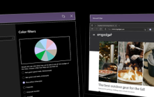
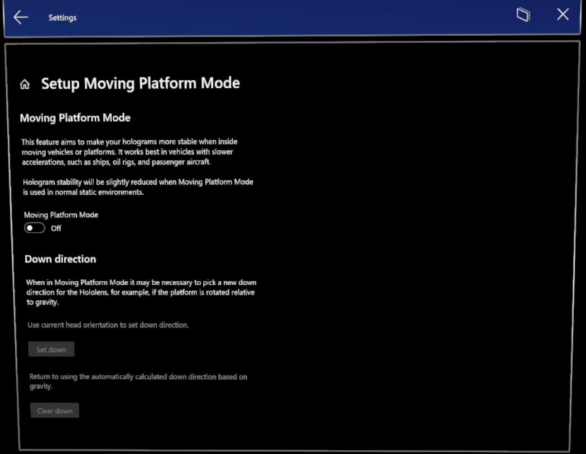

# Insider preview for Microsoft HoloLens

Welcome to the latest Insider Preview builds for HoloLens! It's simple to [get started](hololens-insider.md#start-receiving-insider-builds) and provide valuable feedback for our next major operating system update for HoloLens.

## Windows Insider Release Notes

What's new and on the horizon for HoloLens? Check out these new updates coming to HoloLens!

| Feature | Description | Target Audience | Available in Build |
|---------|-------------|-----------------|--------------------|
| [Color-blind mode](#color-blind-mode)        | Applies filters that adjust the displayed colors for Color-blind users.      | End users        | 20348.1463       |
| [Single app kiosk policy for launching other apps](#single-app-kiosk-policy-for-launching-other-apps) | Allows for app launch of secondary app. | IT Admins | 20348.1470 |
| [Moving Platform Mode Settings](#moving-platform-mode-settings) | Toggle Moving Platform Mode and more via Settings | Ends users | 20348.1474 |
| [Moving Platform Mode MDM policies](#moving-platform-mode-mdm-policies) | Configures new MPM settings via MDM | IT Admins | 20348.1474 |

### Color-blind mode

Added in Insider build 20348.1463

Color-blind mode is useful a great feature that makes HoloLens more accessible. The new color-blind mode can be found in the Settings app under **Settings** -> **Ease of Access** -> **Color filters**. Several new filters are available. Here's a visual example of some of the available filters.

| Off | Grey scale | Tritanopia |
|-----|-----------|------------|
|    |          |           |

### Single app kiosk policy for launching other apps

Introduced a new MDM policy MixedReality\AllowLaunchUriInSingleAppKiosk. This can be enabled to allow for other apps to be launched with in a single app Kiosk, which may be useful for example if you want to launch the Settings app to calibrate your device or change your Wi-fi.

By default, launching applications via [Launcher API (Launcher Class (Windows.System) - Windows UWP applications)](/uwp/api/Windows.System.Launcher?view=winrt-22000&preserve-view=true) is disabled in single app kiosk mode. To enable applications to launch in single app kiosk mode on HoloLens devices, set the policy value to true.

The OMA-URI of new policy: `./Device/Vendor/MSFT/Policy/Config/MixedReality/AllowLaunchUriInSingleAppKiosk`

- Bool value

### Moving Platform Mode Settings

We've added new a new page to the Settings app to configure and control [Moving Platform Mode](hololens2-moving-platform.md). Being able to turn on Moving Platform Mode will no longer require needing to use device portal, which increases usability and security. User can reach the new page by opening the **Settings** app and selecting -> **System** -> **Holograms** and scroll down to see the Moving Platform Mode section and select **Setup Moving Platform Mode**.

From this new page, users will be able to manually turn on Moving Platform Mode by adjusting the toggle.

Uses can also manually set the down direction, if for instance you are using the device in such a way where you don't want gravity to be the down direction. This works well in instances where you may be lying down under what you are working on. Feel free to use this to suit your own space. You can also clear the down direction when done using the device so everything is oriented back to default afterwards.

### Moving Platform Mode MDM policies

#### MixedReality/ConfigureMovingPlatform

This policy controls the behavior of moving platform feature on HoloLens 2, i.e. whether it is turned off / on or it can be toggled by a user. It should only be used by customers who intend to use HoloLens 2 in moving environments with low dynamic motion. Please refer to [HoloLens 2 Moving Platform Mode](hololens2-moving-platform.md) for background information.

The OMA-URI of new policy: `./Device/Vendor/MSFT/Policy/Config/MixedReality/ConfigureMovingPlatform`

Supported values:

- 0 (Default) - Last set user's preference. Initial state is OFF and after that user's preference is persisted across reboots and is used to initialize the system.
- 1 Force off - Moving platform is disabled and can not be changed by user.
- 2 Force on - Moving platform is enabled and can not be changed by user.

#### MixedReality/ManualDownDirectionDisabled

This policy controls whether the user can change down direction manually or not. If no down direction is set by the user then an automatically calculated down direction is used by the system. This policy has no dependency on ConfigureMovingPlatform policy and they can be set independently.

The OMA-URI of new policy: `./Device/Vendor/MSFT/Policy/Config/MixedReality/ManualDownDirectionDisabled`

Supported values:

- False (Default) - User can manually change down direction if they desire, otherwise down direction will be determined automatically based on the measured gravity vector.
- True - User cannot manually change down direction and down direction will be always be determined automatically based on the measured gravity vector.

### Fixes and improvements

- Improvements to Moving Platform Mode when detecting the down direction.
- Fixed an issue around update dialogs.
- Updated inbox Microsoft Edge browser version.
- Fixed an issue where toggling optional diagnostic data didn't persist the chosen setting in telemetry settings page after a reboot.
- Fixed an issue where MDM enrollment was stuck when applied with runtime provisioning for local accounts.
- Fixed an issue where kiosk mode was not falling back to global kiosk (if configured) on encountering failures for AAD group-based kiosk configuration.
- Addressed an issue that prevented the uninstall of side loaded apps in certain scenarios.

### Known Issue - Some users may encounter an update failure with Insider build 20346.1466

If a user has taken an update to the Insider flight, 20346.1466, and it doesn’t appear to be finishing the boot, a clean reflash may be required to move forward again. To see if you have encountered this:

1. Reboot – Hold down the power until the LED’s step down.
1. Power up.
1. Confirm you see the Windows flag at the beginning of the boot and it goes black shortly after that.
1. Connect your HoloLens2 to your PC with USB and run Advanced Recovery companion.
1. Select the HoloLens.
1. If the version says you are running the 20346.1466 build, you likely hit this issue.

#### Who does this tend to affect

Users who have been using their device without flashing it since [Windows Holographic, version 2004](hololens-release-notes-2004.md#windows-holographic-version-2004).

#### Users who are typically unaffected

Users who have flash their device, or unboxed their device, and started using it since [Windows Holographic, version 21H1](hololens-release-notes.md#windows-holographic-version-21h1).

#### Workaround

- [Reflash your device.](hololens-recovery.md#clean-reflash-the-device)

## Start receiving Insider builds

> [!NOTE]
> If you haven’t updated recently, please reboot your device to update state and get the latest build.
>
> - The “Reboot device” voice command works well.
> - You can also choose the restart button in Settings/Windows Insider Program.
>
> We had a bug on the back-end that you may have encountered and this will get you back on track.

On a HoloLens 2 device go to **Settings** > **Update & Security** > **Windows Insider Program** and select **Get started**. Link the account you used to register as a Windows Insider.

> [!NOTE]
> In order to enroll your device in Insider builds, you'll need to enable optional telemetry. If you have not done this already, open the Settings app and select **Privacy** > **Diagnostics & feedback** and then select **Optional diagnostics data**.

Windows insider is now moving to Channels. The **Fast** ring will become the **Dev Channel**, the **Slow** ring will become the **Beta Channel**, and the **Release Preview** ring will become the **Release Preview Channel**. Here is what that mapping looks like:

For more information, see [Introducing Windows Insider Channels](https://blogs.windows.com/windowsexperience/2020/06/15/introducing-windows-insider-channels) on Windows Blogs.
Then, select **Active development of Windows**, choose whether you'd like to receive **Dev Channel** or **Beta Channel** builds, and review the program terms.
Select **Confirm > Restart Now** to finish up. After your device has rebooted, go to **Settings > Update & Security > Check for updates** to get the latest build.

### Update error 0x80070490 work-around

If you encounter an update error 0x80070490 when updating on the Dev or Beta channel, try the following short-term work-around. It involves moving your insider channel, picking up the update and then moving your Insider channel back.

#### Stage one - Release Preview

1. Settings, Update & Security, Windows Insider Program, select **Release Preview Channel**.

2. Settings, Update & Security, Windows Update, **Check for updates**. After the update, continue on to Stage two.

#### Stage two - Dev Channel

1. Settings, Update & Security, Windows Insider Program, select **Dev Channel**.

2. Settings, Update & Security, Windows Update, **Check for updates**.

## FFU download and flash directions

To test with a flight signed ffu, you first have to flight unlock your device prior to flashing the flight signed ffu.

1. On PC:
    1. Download ffu to your PC from [https://aka.ms/hololenspreviewdownload](https://aka.ms/hololenspreviewdownload).

    1. Install ARC (Advanced Recovery Companion) from the Microsoft Store: [https://www.microsoft.com/store/productId/9P74Z35SFRS8](https://www.microsoft.com/store/productId/9P74Z35SFRS8).

1. On HoloLens - Flight Unlock: Open **Settings** > **Update & Security** > **Windows Insider Program** then sign up, reboot device.

1. Flash FFU - Now you can flash the flight signed FFU using ARC.

### Provide feedback and report issues

Please use [the Feedback Hub app](hololens-feedback.md) on your HoloLens to provide feedback and report issues. Using Feedback Hub ensures that all necessary diagnostics information is included to help our engineers quickly debug and resolve the problem.  Issues with the Chinese and Japanese version of HoloLens should be reported the same way.

> [!NOTE]
> Be sure to accept the prompt that asks whether you'd like Feedback Hub to access your Documents folder (select **Yes** when prompted).

## Note for developers

You are welcome and encouraged to try developing your applications using Insider builds of HoloLens.  Check out the [HoloLens Developer Documentation](https://developer.microsoft.com/windows/mixed-reality/development) to get started. Those same instructions work with Insider builds of HoloLens.  You can use the same builds of Unity and Visual Studio that you're already using for HoloLens development.

## Stop receiving Insider builds

If you no longer want to receive Insider builds of Windows Holographic, you can opt out when your HoloLens is running a production build, or you can [recover your device](hololens-recovery.md) using the Advanced Recovery Companion to recover your device to a non-Insider version of Windows Holographic.

> [!CAUTION]
> There is a known issue in which users who un-enroll from Insider Preview builds after manually reinstalling a fresh preview build would experience a blue screen. Afterwards they must manually recover their device. For full details on if you would be impacted or not, please view more on this [Known Issue](hololens-troubleshooting.md#blue-screen-after-unenrolling-from-insider-preview-on-a-device-flashed-with-an-insider-build).

To verify that your HoloLens is running a production build:

1. Go to **Settings > System > About**, and find the build number.

1. [See the release notes for production build numbers](hololens-release-notes.md).

To opt out of Insider builds:

1. On a HoloLens running a production build, go to **Settings > Update & Security > Windows Insider Program**, and select **Stop Insider builds**.

1. Follow the instructions to opt out your device.
