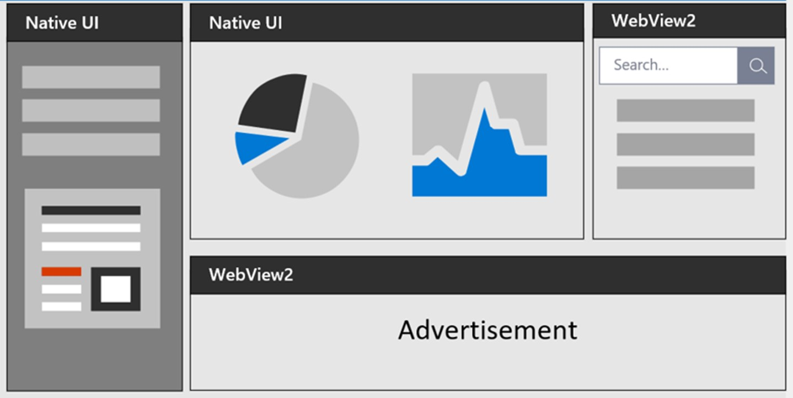
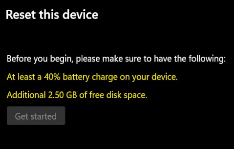
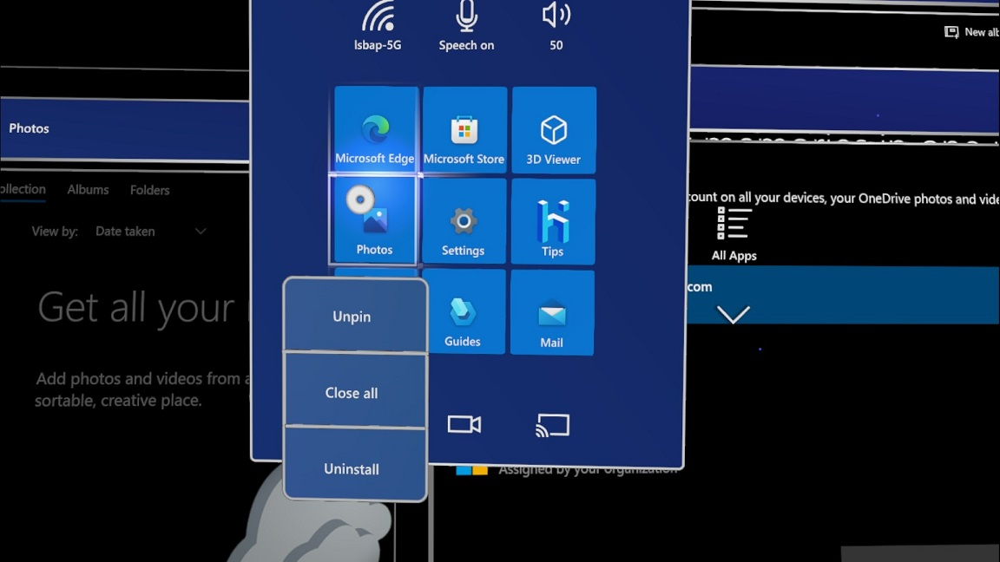

# Insider preview for Microsoft HoloLens

Welcome to the latest Insider Preview builds for HoloLens! [Get started](#start-receiving-insider-builds) and provide valuable feedback on HoloLens for our next major operating system update.

> [!TIP]
>
> Organizations that have moved, or are moving toward, production deployment at scale should keep a subset of test devices on Insider builds to validate new features and builds.

## Windows Insider release notes

Looking for a new feature but don't see it? We released many new features as part of the main builds. Check out the [release notes](hololens-release-notes.md) if you think a feature might be missing.

> [!NOTE]
>
> Only devices in the [Dev channel](#start-receiving-insider-builds) receive these Insider build features.

> [!IMPORTANT]
>
> This next update is on a newer codebase than what currently is available in the main builds. After you update a device to this build, your device won't update to our monthly releases until those releases catch up to the newer codebase. If necessary, you can still flash your device to go back to the general release.

| Feature   | Description  | User or scenario | Available in build |
|-----------|--------------|------------------|---|
| [Store app update from Settings feature](#store-app-update-from-settings) | Introduces the option to manually check for app updates from the Settings app. | All | 10.0.22621.1061 |
| [WebView2 control now available](#webview2-now-available) | The Microsoft Edge WebView2 control allows you to embed web technologies (HTML, CSS, and JavaScript) in your native apps and is now available for the HoloLens2. | All | 10.0.22621.1061 |
| [Device reset requirements in the Settings Application](#device-reset-requirements-in-settings-app) | Devices must have sufficient battery and free disk space to perform a device reset. | All | 10.0.22621.1057 |
| [Removing placements of an app in the mixed world](#removing-placements-of-apps-in-mixed-world) | An option to close one or all placements of an app is now available in the context menu. | All | 10.0.22621.1057 |
| [Automatic update of Dynamics 365 Remote Assist and Dynamics 365 Guides during Autopilot flow](#automatic-update-of-dynamics-365-remote-assist-and-guides-during-autopilot-flow) | When provisioning a HoloLens 2 device using Autopilot, Dynamics 365 applications will update automatically. | IT Admin | 10.0.22621.1057 |
| [Reboot CSP enabled and related changes](#reboot-csp-enabled-and-related-changes-in-intune) | Hololens now supports weekly scheduled reboots and other options. | IT Admin | 10.0.22621.1051 |
| [Update available notification](#update-available-notification) | Shows user that update is available when looking at the start menu. | End User | 10.0.22621.1051 |
| [Autopilot reset experience](#autopilot-reset-experience) | Improvements in Autopilot reset experience to enable users to reset HoloLens 2 and restart Autopilot without requiring manual flashing.| IT Admin  | 10.0.22621.1008 |
| [Biometrics disclosure screen](#biometrics-disclosure-screen) | Displays information to all new users on what biometrics the device uses. | All | 10.0.22621.1008 |
| [Remove users on device](#remove-users-on-a-device) | New policies to manage when to remove users from the device to prevent hitting the maximum limit. | IT Admin  | 10.0.22621.1008 |
| [Fixes improvements](#fixes-and-improvements)  | Fixes and improvements for HoloLens. | All   | 10.0.22621.1006 |

✔️ If you need to delete users from your HoloLens automatically, then see [Remove users on a device](#remove-users-on-a-device).

✔️ If you'd like to set a policy for your HoloLens devices to automatically [reboot on a schedule](#reboot-csp-enabled-and-related-changes-in-intune), then read on.

### Store app update from Settings

While apps from the Microsoft Store are kept up to date automatically by the device, sometimes you may want to manually check for updates to get those app updates sooner. Typically, this is done from within the Microsoft Store app. However, that option will not be available if the Microsoft Store is blocked in your environment. For such environments, you can now manually check for updates to Store apps from the Settings app under Apps -> App updates.

IT admins will be able to block or allow this page with the [Settings/PageVisibilityList policy] (windows/client-management/mdm/policy-csp-settings#pagevisibilitylist) with the URI `ms-settings:appupdate`.

See screenshot below of the Settings app where this feature can be seen.

.png)

### WebView2 Now Available

The Microsoft Edge WebView2 control allows you to embed web technologies (HTML, CSS, and JavaScript) in your native apps and is now available for the HoloLens2. The WebView2 control uses Microsoft Edge as the rendering engine to display the web content in native apps.
With WebView2, you can embed web code in different parts of your native app, or build all of the native app within a single WebView2 instance.

To start building a WebView2 app, see Get started with WebView2 for a general overview.  HoloLens specific documentation will be available soon.

The following is a list of known issues that will be addressed in future Insider release previews:

- Input may not work properly when using popups and context menus.
- Context menus may not be dismissible.  As a workaround, you may use a keyboard to type into the main window, or close and reopen the app.
- There may be black borders on the edges of context menus.
- Any 2D app that uses WebView2 will require a manifest change until the WebView2 NuGet package is released in May.  In addition, all apps targeting HoloLens 2 will need to add the following manifest change.  Note that adding this change will prevent installation on non-HoloLens SKUs such as Desktop PC.  
   
> [!TIP]
> The required manifest details are:
> `<Package   `
> `  xmlns=http://schemas.microsoft.com/appx/manifest/foundation/windows10>  `
> `  <Dependencies>  `
> `  <PackageDependency Name="Microsoft.WebView2Runtime.Stable"      `
> `   Publisher="CN=Microsoft Corporation, O=Microsoft Corporation, L=Redmond, S=Washington, C=US"       `
> `   MinVersion="1.0.0.0"/>  `
> `  </Dependencies> `
> `</Package>`

### Device Reset Requirements in Settings app

In order for a device reset to complete successfully, the following two conditions must be met:  the device must have both sufficient battery charge and free disk space. On the Reset & recovery page, the Get started button will now only be enabled when the device meets a minimum of 40% of battery charge and 6GB free disk space thresholds.

### Removing Placements of Apps in Mixed World

You can now close either the last placement or all placements of an application in the mixed world by selecting the Close or Close all options, respectively, from that application’s context menu. This feature is also available in Kiosk mode. Note: this menu option will only be available when an application has been placed in the mixed world. 

### Automatic update of Dynamics 365 Remote Assist and Guides During Autopilot Flow

When provisioning a HoloLens 2 device using Autopilot, both the Dynamics 365 Remote Assist and Dynamics 365 Guides applications will now be automatically updated to the latest available versions. The update will take place immediately after the Azure Active Directory join is completed.

### Reboot CSP enabled and related changes in Intune

In addition to supporting scheduled single daily reboots, [Reboot CSP](/windows/client-management/mdm/reboot-csp) now supports scheduled weekly reboots.

Create a custom OMA-URI device configuration profile as follows and apply it to a HoloLens device group:

 :::image type="content" alt-text ="This screenshot shows using OMA URI to configure the weekly reboot." source="./images/weekly-reboot-oma-uri.png":::

> [!NOTE]
>
> Setting Reboot CSP through the “Settings catalog” will be supported soon. Until then, use OMA-URI.

1. For the OMA-URI field, specify any of these three options:

   - `./Device/Vendor/MSFT/Reboot/Schedule/Single`
   - `./Device/Vendor/MSFT/Reboot/Schedule/DailyRecurrent`
   - `./Device/Vendor/MSFT/Reboot/Schedule/WeeklyRecurrent`

   > [!NOTE]
   >
   > Setting both DailyRecurrent and WeeklyRecurrent configurations on the same device is not supported.

1. For the **data type** field, choose **string**.

1. For the **value** field, enter a date value for a starting date and time, such as *2023-01-06T10:35:00* to set DailyRecurrent reboots starting on the given date and *two minutes after* the set starting time daily. Similarly, setting WeeklyRecurrent reboots starting at the given date and *two minutes after* the starting time every seven days. For example, if you specify 10:00, the reboot will occur at 10:02.

   > [!NOTE]
   >
   > The actual time of recurrent schedule reboots is about 2 minutes after the configured time. This delay is expected and intentional to preserve the operations and communication states.

### Update available notification

Having up-to-date devices is important. A previous feature improvement lets you see when updates are ready to *install*. With this new update, your device displays when an update is available to *download*. As with desktop devices, when an update is available, your Hololens displays a blue update circle icon. This icon is near your user icon.

1. Select your user icon. The user context menu will open.
1. Select **Download update** to launch the Settings app updates page that shows the update available to download.

   :::image type="content" alt-text="This screenshot shows the start menu context for OS updates." source="images/hl2-update-context-menu-crop-6in.png":::

### Autopilot reset experience

We've added a new setting to improve the Autopilot reset experience if Hololens 2 fails in certain installation scenarios. This setting lets users begin the Autopilot experience again without requiring a manual flash of HoloLens 2 devices. In the ESP configuration, set **Allow users to reset device if installation error occurs** to **Yes** and the device will display a "Reset device" button. If the user selects **Reset device**, after a delay of about 1 minute, HoloLens 2 will reset the operating system and OOBE experience.

### Biometrics disclosure screen

We've changed one of our OOBE screens before the device calibrates to show information on device usage for head, hand, and eye movements. Devices configured to skip calibration won't skip this biometrics disclosure screen, so all new users on a device will see device biometrics usage.  The purpose of this screen is to better inform users about the data being collected.  There are no changes to the data that is being collected.

:::image type="content" alt-text="This screenshot shows the Biometrics OOBE window." source="images/biometrics-oobe-notification.jpg":::

### Remove users on a device

Organizations with scaled deployments of HoloLens 2 devices might encounter the 64-user limit per device that prevents adding users. To address this situation, we've added controls that delete the least recent users from the device at controlled intervals, which is a feature you might have used on the Desktop version. Deleting users in a controlled way is useful for other reasons, too. Removing the inactive accounts speeds up the sign-in process and improves privacy and security by reducing retention of unused data. We use three criteria to determine when to remove user accounts on the device:

- When a user has been inactive on the device past a number of days, configurable via **ProfileInactivityThreshold.**
- When the device has reached a storage threshold, configurable via **StorageCapacityStartDeletion** and **StorageCapacityStopDeletion**.
- When the device has reached the maximum number of supported users (64).
   
Here's how to get started:

1. Set the boolean value for **UserProfileManagement/EnableProfileManager** to **true**.

1. Set the numerical **UserProfileManagement/ProfileInactivityThreshold**, which is the number of days a user must be inactive (not logged on to the device) before the user is deleted. The default value is **30**.
1. Set **UserProfileManagement/StorageCapacityStartDeletion**, a numerical value representing the percentage of free space left when the device begins deleting the least recent users. The Default value is **25%**.

1. Pair **UserProfileManagement/StorageCapacityStartDeletion** with **StorageCapacityStopDeletion** to determine when, based on the free storage percent, to stop deleting profiles.

1. Turn on the deletion policy **UserProfileManagement/DeletionPolicy**, and set it to **2**, which deletes both threshold and inactive users.

   If the **UserProfileManagement/DeletionPolicy** is on, when the device reaches the maximum number of users and is trying to add another, the device deletes the oldest user automatically.

To learn more about these policies, visit [AccountManagement CSP](/windows/client-management/mdm/accountmanagement-csp).

### Fixes and improvements

- Previously, it was possible to install an app in the device context via the EnterpriseModernAppManagement CSP.  It is now possible to uninstall an app in the device context as well.
   
## Start receiving Insider builds

This section explains the steps to prepare devices and then the steps to receive Insider builds.
> [!TIP]
>
> Once you enroll a device into Insider builds, we strongly recommend that your organization keeps a set of test devices enrolled, too. With a set of test devices, your organization can validate builds more easily as they come out. Timely and efficient validation creates an easier experience and helps if your normal production devices are blocked from Insider builds.

> [!NOTE]
>
> Windows Insider is moving to Channels. The **Fast** ring will become the **Dev Channel**, the **Slow** ring will become the **Beta Channel**, and the **Release Preview** ring will become the **Release Preview Channel**. Here’s how that mapping looks:
>
> :::image type="content" alt-text="Screenshot of the Windows Insider Channels explanation." source="./images/WindowsInsiderChannels.png":::
>
> For more information, see [Introducing Windows Insider Channels](https://blogs.windows.com/windowsexperience/2020/06/15/introducing-windows-insider-channels) on[ Windows Blogs](https://blogs.windows.com/).

### Prerequisites

These steps explain what to do before you sign up for Insider builds. 

1. Enable telemetry. Normally optional, telemetry is required to enroll your device in Insider builds.

   1. In the **Settings app** > **Privacy** > **Diagnostics & feedback** > **Optional diagnostics data**.

   1. **Enable** telemetry.

1. Get the latest build. Reboot your device using one of two methods:
     - Use the voice command "Reboot device."
     - Choose the restart button in Settings.

### Access the Windows Insider Program and check for updates

1. On a HoloLens 2 device, go to **Settings** > **Update & Security** > **Windows Insider Program** > **Get started**.

1. Link to the account you used to register as a Windows Insider.

1. Select **Active development of Windows**.

1. Choose whether you'd like to receive **Dev Channel** or **Beta Channel** builds.

1. Review and accept the program terms.

1. Select **Confirm** > **Restart Now**. Your device will reboot.

1. Go to **Settings** > **Update & Security** > **Check for updates** to get the latest build.

### Update error 0x80070490 workaround

If you encounter update error 0x80070490 when updating on the Dev or Beta channel, try the following short-term workaround. It involves moving your Insider channel, picking up the update, and then moving your Insider channel back.

#### Stage one - Release Preview

1. Select **Settings** > **Update & Security** > **Windows Insider Program** > **Release Preview Channel**.

1. Select **Settings** > **Update & Security** > **Windows Update** > **Check for updates**.

1. Accept any available update. After the update, continue to Stage two.

#### Stage two - Dev Channel

1. Select **Settings** > **Update & Security** > **Windows Insider Program** > **Dev Channel**.

1. Select **Settings** > **Update & Security** > **Windows Update** > **Check for updates**.

1. Accept any available update.

## FFU download and flash directions

1. To test with a flight signed `.ffu`, flight unlock your device prior to flashing the flight signed FFU:

   - On a PC:
      1. Download `.ffu` to your PC from [https://aka.ms/hololenspreviewdownload](https://aka.ms/hololenspreviewdownload).
      1. Install [ARC (Advanced Recovery Companion) from the Microsoft Store](https://www.microsoft.com/store/productId/9P74Z35SFRS8): [https://www.microsoft.com/store/productId/9P74Z35SFRS8](https://www.microsoft.com/store/productId/9P74Z35SFRS8).

   - On HoloLens:
      1. Open **Settings** > **Update & Security** > **Windows Insider Program**.
      1. Sign up.
      1. Reboot the device.

1. Flash FFU. Now you can flash the flight signed FFU using ARC.

## Provide feedback and report issues

Use [the Feedback Hub app](hololens-feedback.md) on your HoloLens to provide feedback and report issues. Feedback Hub helps you include the necessary diagnostics information to help our engineers quickly debug and resolve any problem. Report issues with the Chinese and Japanese versions of HoloLens the same way.

> [!NOTE]
>
> Be sure to select **Yes** when a prompt asks whether you'd like Feedback Hub to access your documents folder.

## Note for developers

You're welcome and encouraged to try developing your applications using Insider builds of HoloLens. Check out the [HoloLens Developer Documentation](https://developer.microsoft.com/windows/mixed-reality/development) to get started. Those instructions also work with Insider builds for HoloLens. Use the same builds for Unity and Visual Studio that you're already using for HoloLens development.

## Stop receiving Insider builds

If you no longer want to receive Insider builds of Windows Holographic, you have two options:

- Opt out on a HoloLens running a production build:
   1. Go to **Settings** > **Update & Security** > **Windows Insider Program** > **Stop Insider builds**.
   1. Follow the instructions to opt out your device.

- Use the ARC to [recover your device](hololens-recovery.md) to a non-Insider version of Windows Holographic.

> [!CAUTION]
>
> A known issue causes users who un-enroll from the Windows Insider program, and then manually install a fresh Insider preview build, to experience a blue screen. Afterward, the user must recover the device manually. Learn more about this [Known Issue](hololens-troubleshooting.md#blue-screen-after-unenrolling-from-insider-preview-on-a-device-flashed-with-an-insider-build).
>
> To verify that your HoloLens is running a production build:
>
> 1. Locate the build number through **Settings** > **System** > **About**.
> 1. [Check the build number against the release notes for production build numbers](hololens-release-notes.md).

