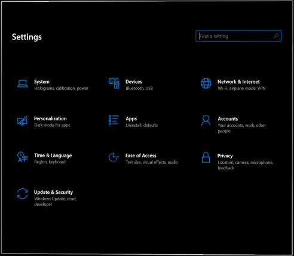

# New Settings app

With this release, we're introducing a new version of the Settings app. The new Settings app includes new features and expanded settings for HoloLens 2 in the following areas: Sound, Power & sleep, Network & Internet, Apps, Accounts, Ease of Access, and more.

> [!NOTE]
> Because the new Settings app is distinct from the legacy Settings app, any Settings windows you previously placed around your environment will be removed upon update.

**New features and settings**
- Settings search: search for settings from the Settings homepage using keywords or the setting's name.
- System > Sound:
  - Input and output audio devices: independently choose your input and output audio devices (for example, listen to audio via Bluetooth headphones or use a USB-C microphone for audio input).
    > [!NOTE]
    > Bluetooth microphones are not supported by HoloLens 2.
  - App volume: independently adjust the volume of each app. See [per app volume control](#per-app-volume-control).
- System > Power & sleep: choose when the device should go to sleep after a period of inactivity.
- System > Battery: manually enable battery saver mode or set a battery threshold at which point battery saver mode turns on automatically.
- Devices > USB: you can disable USB connections by default.
- Network & Internet:
  - USB-C Ethernet adapters will now appear in Network & Internet.
  - USB-C Ethernet adapter settings are now available, including its IP address.
  - You can now enable airplane mode on HoloLens 2.
- Apps: you can reset the default apps used for file and link types. For more information see [Default app picker](#default-app-picker).
- Accounts > Other users: device owners can add users, upgrade standard users to device owners, downgrade device owners to standard users, and remove users.
- Ease of Access: change text size and some visual effects.

**Known issues**
- Previously placed Settings windows will be removed (see note above).
- You can no longer rename your device with the Settings app. IT admins can rename devices by using the [Windows Autopilot for HoloLens 2](https://docs.microsoft.com/hololens/hololens2-autopilot) device name template or the MDM [DevDetail CSP](https://docs.microsoft.com/windows/client-management/mdm/devdetail-csp) Ext/Microsoft/DNSComputerName node.
- The Ethernet page shows a virtual Ethernet device ("UsbNcm") at all times.
- Battery usage for the new Microsoft Edge may not be accurate, due to its nature as a Win32 desktop application supported by a UWP adapter layer (no fix anticipated soon).

### Default app picker

When you activate a hyperlink or open a file type with more than one installed app, which supports it, you will see a new window open prompting you to select which installed app should handle the file or link type. In this window, you can also choose to have the selected app handle the file or link type "Once" or "Always."

If you choose "Always" but later want to change which app handles a particular file or link type, you can reset your saved defaults in **Settings > Apps**. Scroll to the bottom of the page and select the **Clear** button under "Default apps for file types" and/or "Default apps for link types." Unlike the similar setting on desktop PCs, you can't reset individual file type defaults.

### Per app volume control

Now in this Windows Insider build users can manually adjust the volume level of each app. This allows for users to better focus on the apps that they need to, or better hear when using multiple apps. Such as needing to turn down volume of one app while calling another person for remote assistance in another.

To set the volume of an individual app navigate to **Settings** -> **System** -> **Sound**, and under Advanced sound options select **App volume and device preferences**.

 