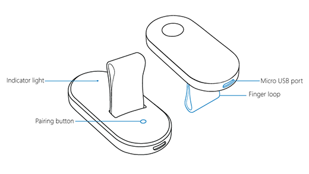

# Use the HoloLens (1st gen) clicker

The clicker was designed specifically for HoloLens (1st gen) and gives you another way to interact with holograms. It comes with HoloLens (1st gen), in a separate box.

Use it in place of hand gestures to select, scroll, move, and resize apps.

## Clicker hardware and pairing

The HoloLens (1st gen) clicker has a finger loop to make it easier to hold, and an indicator light.

### Clicker indicator lights

Here's what the lights on the clicker mean.

- **Blinking white**. The clicker is in pairing mode.
- **Fast-blinking white**. Pairing was successful.
- **Solid white**. The clicker is charging.
- **Blinking amber**. The battery is low.
- **Solid amber**. The clicker ran into an error and you'll need to restart it. While pressing the pairing button, click and hold for 15 seconds.

### Pair the clicker with your HoloLens (1st gen)

1. Use the bloom gesture to go to **Start**, then select **Settings** > **Devices** and verify that Bluetooth is on.
1. On the clicker, press and hold the pairing button until the status light blinks white.
1. On the pairing screen, select **Clicker** > **Pair**.

### Charge the clicker

When the clicker battery is low, the battery indicator will blink amber. Plug the Micro USB cable into a USB power supply to charge the device.

## Use the clicker with HoloLens (1st gen)

### Hold the clicker

To put on the clicker, slide the loop over your ring or middle finger so that the Micro USB port faces toward your wrist. Rest your thumb in the indentation.

### Clicker gestures

Clicker gestures are small wrist rotations, not the larger movements used for HoloLens hand gestures. And HoloLens recognizes your gestures and clicks even if the clicker is outside the [gesture frame](hololens1-basic-usage.md), so you can hold the clicker in the position that's most comfortable for you​.

- **Select**. To select a hologram, button, or other element, gaze at it, then click.

- **Click and hold**. Click and hold your thumb down on the button to do some of the same things you would with tap and hold, such as move or resize a hologram.

- **Scroll**. On the app bar, select **Scroll Tool**. Click and hold, then rotate the clicker up, down, left, or right. To scroll faster, move your hand farther from the center of the scroll tool.

- **Zoom**. On the app bar, select **Zoom Tool**. Click and hold, then rotate the clicker up to zoom in, or down to zoom out.

> [!TIP]
> To zoom in or out when using Microsoft Edge, gaze at a page and double-click.

## Restart or recover the clicker

Here are some things to try if the HoloLens clicker is unresponsive or isn’t working well.

### Restart the clicker

Use the tip of a pen to press and hold the pairing button. At the same time, click and hold the clicker for 15 seconds. If the clicker was already paired with your HoloLens, it will stay paired after it restarts.

If the clicker won't turn on or restart, try charging it by using the HoloLens charger. If the battery is very low, it might take a few minutes for the white indicator light to turn on.

### Re-pair the clicker

Select **Settings** > **Devices** and select the clicker. Select **Remove**, wait a few seconds, then pair the clicker again.

### Recover the clicker

If restarting and re-pairing the clicker don’t fix the problem, the Windows Device Recovery Tool can help you recover it. The recovery process may take some time, and it will install the latest version of the clicker software. To use the tool, you’ll need a computer running Windows 10 or later that has at least 4 GB of free storage space.

To recover the clicker:

1. Download and install the [Windows Device Recovery Tool](https://dev.azure.com/ContentIdea/ContentIdea/_queries/query/8a004dbe-73f8-4a32-94bc-368fc2f2a895/) on your computer.
1. Connect the clicker to your computer by using the Micro USB cable that came with your HoloLens.
1. Run the Windows Device Recovery Tool and follow the instructions.

If the clicker isn’t automatically detected, select **My device was not detected** and follow the instructions to put your device into recovery mode.
