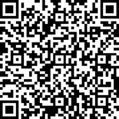
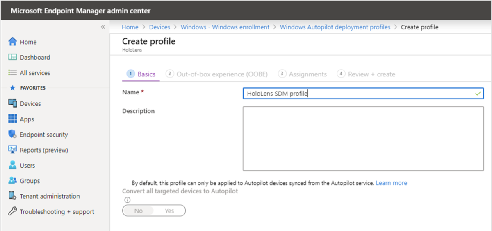
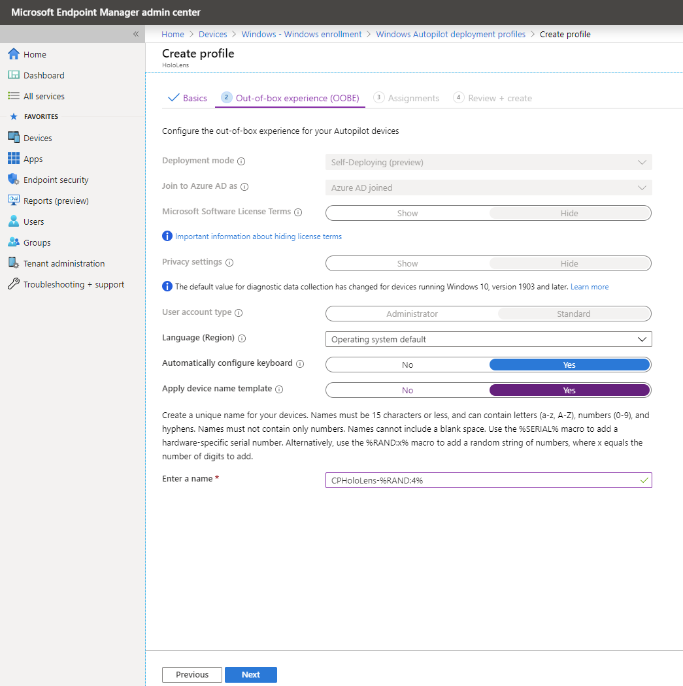
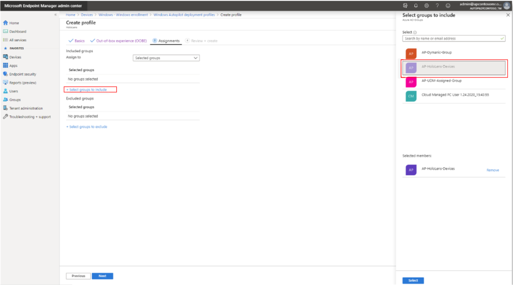
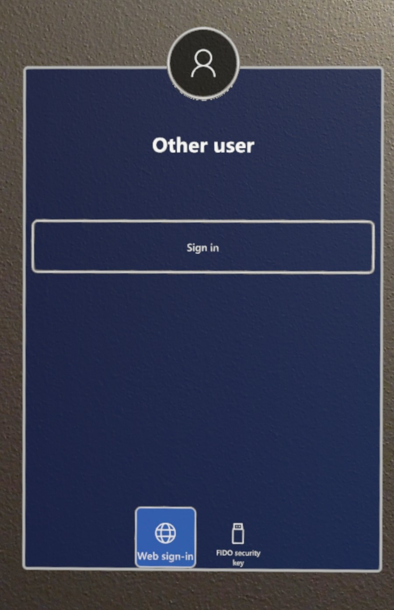
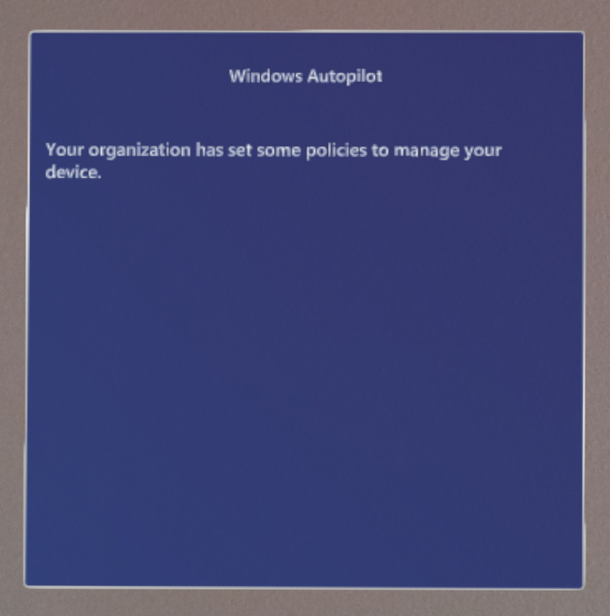

# Windows Autopilot for HoloLens 2

When you set up HoloLens 2 devices for the Windows Autopilot program, your users can follow a simple process to provision the devices from the cloud.

This Autopilot program supports Autopilot self-deploying mode to provision HoloLens 2 devices as shared devices under your tenant. Self-deploying mode leverages the device's preinstalled OEM image and drivers during the provisioning process. A user can provision the device without putting the device on and going through the Out-of-the-box Experience (OOBE). To learn more about Windows Autopilot for Windows 10 click [here](https://docs.microsoft.com/windows/deployment/windows-autopilot/windows-autopilot).

When a user starts the Autopilot self-deploying process, the process completes the following steps:

1. Join the device to Azure Active Directory (Azure AD).
   > [!NOTE]  
   > Autopilot for HoloLens does not support Active Directory join or Hybrid Azure AD join.
1. Use Azure AD to enroll the device in Microsoft Intune (or another MDM service).
1. Download the device-targeted policies, user-targeted apps, certificates, and networking profiles.
1. Provision the device.
1. Present the sign-in screen to the user.

## Windows Autopilot for HoloLens 2 Private Preview

Please follow the steps below to set up your environment for the private preview:

1. Make sure that you meet the requirements for Windows Autopilot for HoloLens 2
1. Enroll in the Windows Autopilot for HoloLens 2 private preview program
1. Verify that your tenant is flighted (enrolled to participate in the program)
1. Register your devices in Windows Autopilot
1. Create a device group
1. Create a deployment profile
1. Verify the ESP configuration
1. Configure a custom configuration profile for HoloLens devices (known issue)
1. Verify the profile status of the HoloLens devices


### 1. Make sure that you meet the requirements for Windows Autopilot for HoloLens 2

**Review the following sections of the Windows Autopilot requirements article:**

- [Network requirements](https://docs.microsoft.com/windows/deployment/windows-autopilot/windows-autopilot-requirements#networking-requirements)  
- [Licensing requirements](https://docs.microsoft.com/windows/deployment/windows-autopilot/windows-autopilot-requirements#licensing-requirements)  
- [Configuration requirements](https://docs.microsoft.com/windows/deployment/windows-autopilot/windows-autopilot-requirements#configuration-requirements)

**Review the "[Requirements](https://docs.microsoft.com/windows/deployment/windows-autopilot/self-deploying#requirements)" section of the Windows Autopilot Self-Deploying mode article.** Your environment has to meet these requirements as well as the standard Windows Autopilot requirements. You do not have to review the "Step by step" and "Validation" sections of the article. The procedures later in this article provide corresponding steps that are specific to HoloLens. For information about how to register devices and configure profiles, see [4. Register devices in Windows Autopilot](#4-register-devices-in-windows-autopilot) and [6. Create a deployment profile](#6-create-a-deployment-profile) in this article. These sections provide steps that are specific to HoloLens.

> [!IMPORTANT]  
> Windows Autopilot for HoloLens 2 has specific operating system requirements. Autopilot relies on Windows Holographic, version 2004 (build 19041.1103 or later) being pre-installed on HoloLens devices. Devices delivered until late September 2020 have Windows Holographic, version 1903 pre-installed. Please contact your distributor to learn about when Autopilot-ready devices can be shipped to you. If you wish to participate to the private preview, please review instructions and requirements below.

Autopilot specific information per HoloLens OS releases.
- In order to use Autopilot a device must have the [Windows Holographic, version 2004](hololens-release-notes.md#windows-holographic-version-2004) release or newer.
- In order to use Autopilot by use of Wi-Fi a device must have the [Windows Holographic, version 20H2](hololens-release-notes.md#windows-holographic-version-20h2) release or newer. However these builds may still use ethernet adapters. 
- On builds [Windows Holographic, version 20H2](hololens-release-notes.md#windows-holographic-version-20h2) a new device management option [Tenantlockdown CSP and Autopilot](hololens2-autopilot.md#tenantlockdown-csp-and-autopilot) has been enabled.  

If you would like to either confirm the build version on your device or update it, please connect it to your Windows 10 PC and launch [Advanced Recovery Companion](https://www.microsoft.com/store/productId/9P74Z35SFRS8). 

**If you wish to try the Autopilot preview, before you start the OOBE and provisioning process, make sure that the HoloLens devices meet the following requirements:**

- Ensure your device is on Windows Holographic, version 2004 (build 19041.1103 or later). If the latest OS is not pre-installed you must manually update using the [Advanced Recovery Companion (ARC)](https://www.microsoft.com/p/advanced-recovery-companion/9p74z35sfrs8?rtc=1&activetab=pivot:overviewtab). You can find instructions [here](https://docs.microsoft.com/hololens/hololens-recovery#clean-reflash-the-device). 
- Your devices must be registered in Windows Autopilot. For information about how to register devices see [4. Register devices in Windows Autopilot](#4-register-devices-in-windows-autopilot). The recommended path is for your reseller or distributor to register devices for you.  
- In the [Windows Holographic, version 2004](hololens-release-notes.md#windows-holographic-version-2004) release, devices need to be connected to the internet before turning on the HoloLens and initiating the Autopilot provisioning process. Connect your device to Ethernet using a "USB-C to Ethernet" adapter for wired internet connectivity.
- In the [Windows Holographic, verison 20H2](hololens-release-notes.md#windows-holographic-version-20h2) release, devices may connect to Wi-Fi in OOBE to detect Autopilot. 
- The devices are not already members of Azure AD, and are not enrolled in Intune (or another MDM system). The Autopilot self-deploying process completes these steps. To make sure that all the device-related information is cleaned up, check the **Devices** pages in both Azure AD and Intune Portals.
- To configure and manage the Autopilot self-deploying mode profiles, make sure that you have access to [Microsoft Endpoint Manager admin center](https://endpoint.microsoft.com).


### 2. Enroll in the Windows Autopilot for HoloLens 2 program

**To participate in the program, you must have your tenant enrolled to the Private Preview program. This enables HoloLens-specific Intune (aka MEM) UI controls for Autopilot.** To do this, go to  [Windows Autopilot for HoloLens Private Preview request](https://aka.ms/APHoloLensTAP) or use the following QR code to submit a request.  

  

Microsoft flights tenants once a week. You will receive an email notification once the flighting is complete. 

In this request, provide the following information:

- Tenant domain
- Tenant ID
- Number of HoloLens 2 devices that are participating in this evaluation
- Number of HoloLens 2 devices that you plan to deploy by using Autopilot self-deploying mode

### 3. Verify that your tenant is flighted

To verify that your tenant is flighted for the Autopilot program after you submit your request, follow these steps:

1. Sign in to [Microsoft Endpoint Manager admin center](https://endpoint.microsoft.com).
1. Select **Devices** > **Windows** > **Windows enrollment** > **Windows Autopilot deployment profiles** > **Create profile**.  
   
   
  You should see a list that includes **HoloLens**. If this option is not present, use one of the [Feedback](hololens2-autopilot.md#feedback-for-autopilot) options to contact us.

### 4. Register devices in Windows Autopilot

In the preparation phase, there are two primary ways you can register devices to Windows Autopilot: 

1. **Contact your distributor or reseller when you place an order to have your devices registered**
or
2. **Retrieve the hardware hash (also known as the hardware ID) and register the device manually.** 

For more information on device registration please review the [Adding devices to Autopilot](https://docs.microsoft.com/windows/deployment/windows-autopilot/add-devices) documentation.  

**Retrieve a device hardware hash**

The device can record its hardware hash in a CSV file during the OOBE process, or later when a device owner starts the diagnostic log collection process (described in the following procedure). Typically, the device owner is the first user to sign in to the device.

1. Start the HoloLens 2 device.
1. On the device, press the Power and Volume Down buttons at the same time and then release them. The device collects diagnostic logs and the hardware hash, and stores them in a set of .zip files. 
   1. For full details and an instructional video for how to preform this please read about [Offline Diagnostics](hololens-diagnostic-logs.md#offline-diagnostics). 
1. Use a USB-C cable to connect the device to a computer.
1. On the computer, open File Explorer. Open **This PC\\\<*HoloLens device name*>\\Internal Storage\\Documents**, and locate the AutopilotDiagnostics.zip file.  

   > [!NOTE]  
   > The .zip file may not immediately be available. If the file is not ready yet you may see a HoloLensDiagnostics.temp file in the Documents folder. To update the list of files, refresh the window.

1. Extract the contents of the AutopilotDiagnostics.zip file.
1. In the extracted files, locate the CSV file that has a file name prefix of "DeviceHash." Copy that file to a drive on the computer where you can access it later.  
   > [!IMPORTANT]  
   > The data in the CSV file should use the following header and line format:
   > ```
   > Device Serial Number,Windows Product ID,Hardware Hash,Group Tag,Assigned User <serialNumber>,<ProductID>,<hardwareHash>,<optionalGroupTag>,<optionalAssignedUser>
   >```

**Register the device in Windows Autopilot**

1. In Microsoft Endpoint Manager Admin Center, select **Devices** > **Windows** > **Windows enrollment**, and then select **Devices** > **Import** under **Windows Autopilot Deployment Program**.

1. Under **Add Windows Autopilot devices**, select the DeviceHash CSV file, select **Open**, and then select **Import**.  
   
   
1. After the import finishes, select **Devices** > **Windows** > **Windows enrollment** > **Devices** > **Sync**. The process might take a few minutes to complete, depending on how many devices are being synchronized. To see the registered device, select **Refresh**.  
   
     

### 5. Create a device group

1. In Microsoft Endpoint Manager admin center, select **Groups** > **New group**.
1. For **Group type**, select **Security**, and then enter a group name and description.
1. For **Membership type**, select either **Assigned** or **Dynamic Device**.
1. Do one of the following:  
   
   - If you selected **Assigned** for **Membership type** in the previous step, select **Members**, and then add Autopilot devices to the group. Autopilot devices that aren't yet enrolled are listed by using the device serial number as the device name.
   - If you selected **Dynamic Devices** for **Membership type** in the previous step, select **Dynamic device members**, and then enter code in **Advanced rule** that resembles the following:
     - If you want to create a group that includes all of your Autopilot devices, type: `(device.devicePhysicalIDs -any _ -contains "[ZTDId]")`
     - Intune's group tag field maps to the **OrderID** attribute on Azure AD devices. If you want to create a group that includes all of your Autopilot devices that have a specific group tag (the Azure AD device OrderID), you must type: `(device.devicePhysicalIds -any _ -eq "[OrderID]:179887111881")`
     - If you want to create a group that includes all your Autopilot devices that have a specific Purchase Order ID, type: `(device.devicePhysicalIds -any _ -eq "[PurchaseOrderId]:76222342342")`

     > [!NOTE]  
     > These rules target attributes that are unique to Autopilot devices.
1. Select **Save**, and then select **Create**.

### 6. Create a deployment profile

1. In Microsoft Endpoint Manager admin center, select **Devices** > **Windows** > **Windows enrollment** > **Windows Autopilot deployment profiles** > **Create profile** > **HoloLens**.
1. Enter a profile name and description, and then select **Next**.  
   
   
1. On the **Out-of-box experience (OOBE)** page, most of the settings are pre-configured to streamline OOBE for this evaluation. Optionally, you can configure the following settings:  

   - **Language (Region)**: Select the language for OOBE. We recommend that you select a language from the list of [supported languages for HoloLens 2](hololens2-language-support.md).
   - **Automatically configure keyboard**: To make sure that the keyboard matches the selected language, select **Yes**.
   - **Apply device name template**: To automatically set the device name during OOBE, select **Yes** and then enter the template phrase and placeholders in **Enter a name** For example, enter a prefix and `%RAND:4%`&mdash;a placeholder for a four-digit random number.
     > [!NOTE]  
     > If you use a device name template, the OOBE process restarts the device one additional time after it applies the device name and before it joins the device to Azure AD. This restart enables the new name to take effect.  

   
1. After you configure the settings, select **Next**.
1. On the **Scope tags** page, optionally add the scope tags that you want to apply to this profile. For more information about scope tags, see [Use role-based access control and scope tags for distributed IT](https://docs.microsoft.com/mem/intune/fundamentals/scope-tags.md). When finished, select **Next**.
1. On the **Assignments** page, select **Selected groups** for **Assign to**.
1. Under **SELECTED GROUPS**, select **+ Select groups to include**.
1. In the **Select groups to include** list, select the device group that you created for the Autopilot HoloLens devices, and then select **Next**.  
  
   If you want to exclude any groups, select **Select groups to exclude**, and select the groups that you want to exclude.

   
1. On the **Review + Create** page, review the settings and then select **Create** to create the profile.  
   
   

### 7. Verify the ESP configuration

The Enrollment Status Page (ESP) displays the status of the complete device configuration process that runs when an MDM managed user signs into a device for the first time. Make sure that your ESP configuration resembles the following, and verify that the assignments are correct.  


### 8. Verify the profile status of the HoloLens devices

1. In Microsoft Endpoint Manager Admin Center, select **Devices** > **Windows** > **Windows enrollment** > **Devices**.
1. Verify that the HoloLens devices are listed, and that their profile status is **Assigned**.  
   > [!NOTE]  
   > It may take a few minutes for the profile to be assigned to the device.  
   
   

## Windows Autopilot for HoloLens 2 User Experience

Once the above instructions are completed, your HoloLens 2 users will go through the following experience to provision their HoloLens devices:  

1. Autopilot experience requires internet access. Please use one of following options to provide internet access:
    - Connect your device to a Wi-Fi network in OOBE and then let it detect Autopilot experience automatically. This is the only time you will need to interact with OOBE until Autopilot experience completes on its own. Please note that by default HoloLens 2 waits for 10 seconds to detect Autopilot after detecting internet. If no autopilot profile is detected within 10 seconds, OOBE will present EULA. If you encounter this scenario, please reboot your device so another attempt can be made to detect Autopilot. Please also note that OOBE can wait indefinitely for Autopilot only if TenantLockdown policy is set on the device.
    - Connect your device with Ethernet using "USB-C to Ethernet" adapters for wired internet connectivity and let HoloLens 2 complete Autopilot experience automatically.
    - Connect your device with "USB-C to Wifi" adapters for wireless internet connectivity and let HoloLens 2 complete Autopilot experience automatically.

       > [!NOTE]
       > Using Autopilot will have an effect on the [device owner](security-adminless-os.md#device-owner).
   
       > [!IMPORTANT]  
       > Devices attempting to use Wi-Fi networks in OOBE for Autopilot must be on [Windows Holographic, verison 20H2](hololens-release-notes.md#windows-holographic-version-20h2).
       >
       > For devices using ethernet adapters you must connect the device to the network before the Out-of-the-Box-Experience (OOBE) starts. The device determines whether it is provisioning as an Autopilot device while on the first OOBE screen. If the device cannot connect to the network, or if you choose not to provision the device as an Autopilot device, you cannot change to Autopilot provisioning at a later time. Instead, you would have to start this procedure over in order to provision the device as an Autopilot device.

1. The device should automatically start OOBE. Do not interact with OOBE. Instead sit, back and relax! Let HoloLens 2 detect network connectivity and allow it complete OOBE automatically. The device may restart during OOBE. The OOBE screens should resemble the following.
   
   
   
   

1. At the end of OOBE, you can sign in to the device by using your user name and password.

   

## Tenantlockdown CSP and Autopilot
- Keeps devices on the organization's tenant by locking them to the tenant even through device reset or reflash. With further security by disallowing account creation in via provisioning. 

HoloLens 2 devices now support TenantLockdown CSP as of Windows Holographic version 20H2. 

[TenantLockdown](https://docs.microsoft.com/windows/client-management/mdm/tenantlockdown-csp) CSP enables HoloLens 2 to be tied to MDM enrollment using Autopilot only. Once TenantLockdown CSP’s RequireNetworkInOOBE node is set to either true or false (initially set) value on HoloLens 2, that value remains on the device despite re-flashing, OS updates, etc. 

Once TenantLockdown CSPs’ RequireNetworkInOOBE node is set to true on HoloLens 2, OOBE waits indefinitely for Autopilot profile to be successfully downloaded and applied, after network connectivity. 

Once TenantLockdown CSPs’ RequireNetworkInOOBE node is set to true on HoloLens 2, following operations are disallowed in OOBE: 
- Creating local user using runtime provisioning 
- Performing AAD join operation via runtime provisioning 
- Selecting who owns the device in OOBE experience 

### How to set this using Intune? 
1. Create a custom OMA URI device configuration profile and specify true for RequireNetworkInOOBE node as shown below.
OMA-URI value should be ./Vendor/MSFT/TenantLockdown/RequireNetworkInOOBE

   > [!div class="mx-imgBorder"]
   > 

1. Create a group and assign the device configuration profile to that device group. 

1. Make the HoloLens 2 device member of the group created in previous step and trigger sync.  

Verify in the Intune portal that device configuration has been successfully applied. Once this device configuration successfully applies on the Hololens 2 device, effects of TenantLockdown will be active.

### How to unset TenantLockdown’s RequireNetworkInOOBE on HoloLens 2 using Intune? 
1. Remove the HoloLens 2 from the device group to which the device configuration created above was previously assigned. 

1. Create a custom OMA URI based device configuration profile and specify false for RequireNetworkInOOBE as shown below. 
OMA-URI value should be ./Vendor/MSFT/TenantLockdown/RequireNetworkInOOBE

   > [!div class="mx-imgBorder"]
   > 

1. Create a group and assign the device configuration profile to that device group. 

1. Make the HoloLens 2 device member of the group created in previous step and trigger sync.

Verify in the Intune portal that device configuration has been successfully applied. Once this device configuration successfully applies on the Hololens 2 device, effects of TenantLockdown will be inactive. 

### What would happen during OOBE, if Autopilot profile is unassigned on a HoloLens after TenantLockdown was set to true? 
OOBE will wait indefinitely for Autopilot profile to download and following dialog will be presented. In order to remove effects of TenantLockdown, device must be enrolled with its original tenant first using Autopilot only and RequireNetworkInOOBE must be unset as described in previous step before restrictions introduced by TenantLockdown CSP are removed. 



## Known Issues

- You cannot install applications that use the device security context.
- When Wi-fi connection is first setup, it is possible sometimes autopilot profile is not downloaded within 10 seconds (default wait time) and the End User License Agreement page is presented. In this scenario, please put the device to sleep and then wake again or reboot the device and let it try again.

### Troubleshooting

The following articles may be a useful resource for you to learn more information and troubleshoot Autopilot Issues, however please be aware that these articles are based on Windows 10 Desktop and not all information may apply to HoloLens:
- [Windows Autopilot - known issues](https://docs.microsoft.com/mem/autopilot/known-issues)
- [Troubleshoot Windows device enrollment problems in Microsoft Intune](https://docs.microsoft.com/mem/intune/enrollment/troubleshoot-windows-enrollment-errors)
- [Windows Autopilot - Policy Conflicts](https://docs.microsoft.com/mem/autopilot/policy-conflicts)

## Feedback for Autopilot

To provide feedback or report issues, use one of the following methods:

- Use the Feedback Hub app. You can find this app on a HoloLens-connected computer. In Feedback Hub, select the **Enterprise Management** > **Device** category.  

- If you encounter issues in Intune during registration of device or Autopilot profile not getting assigned, please open a support ticket at [https://aka.ms/apsupport](https://aka.ms/apsupport) .
- If you encounter issues on HoloLens device during the Autopilot experience, please open a support ticket at [https://aka.ms/hlsupport](https://aka.ms/hlsupport) with [offline diagnostic logs](hololens-diagnostic-logs.md#offline-diagnostics).

  Provide a detailed description in your message. However, unless Support personnel specifically request it, do not include data such as screenshots or logs. Such data might include private or personally identifiable information (PII).
