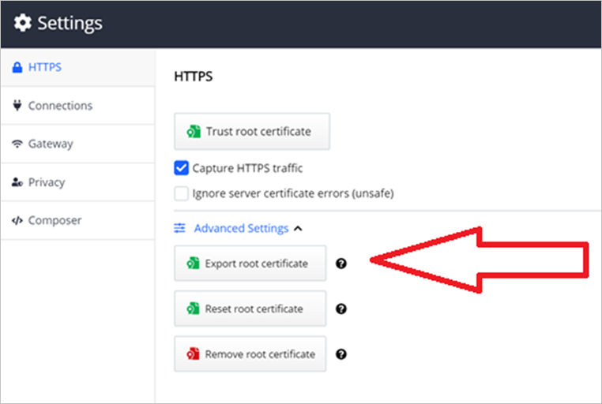
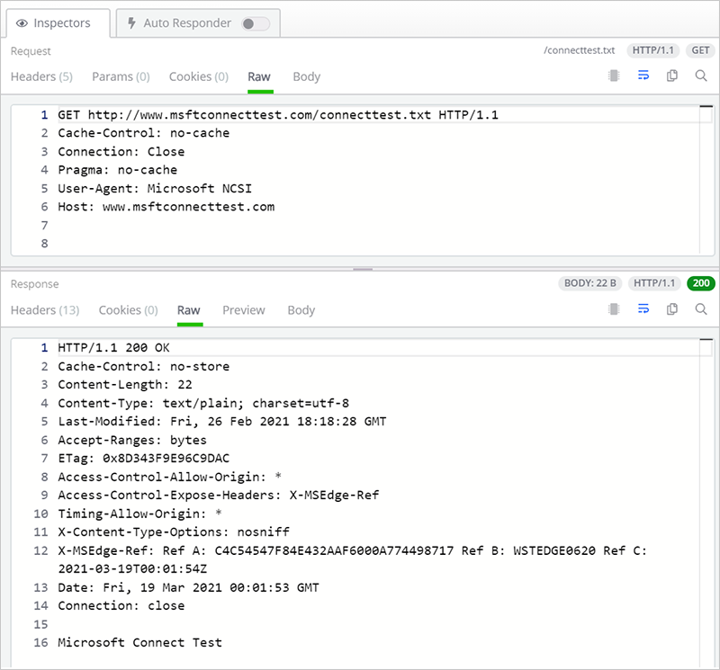
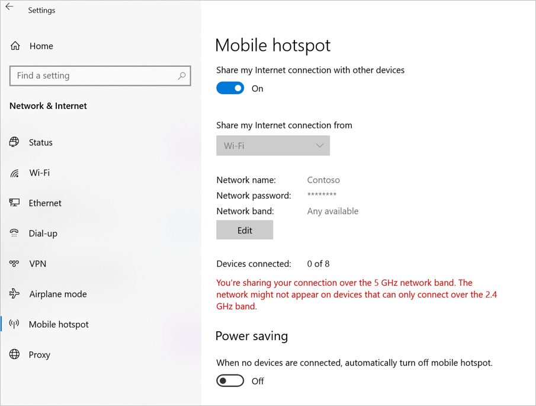
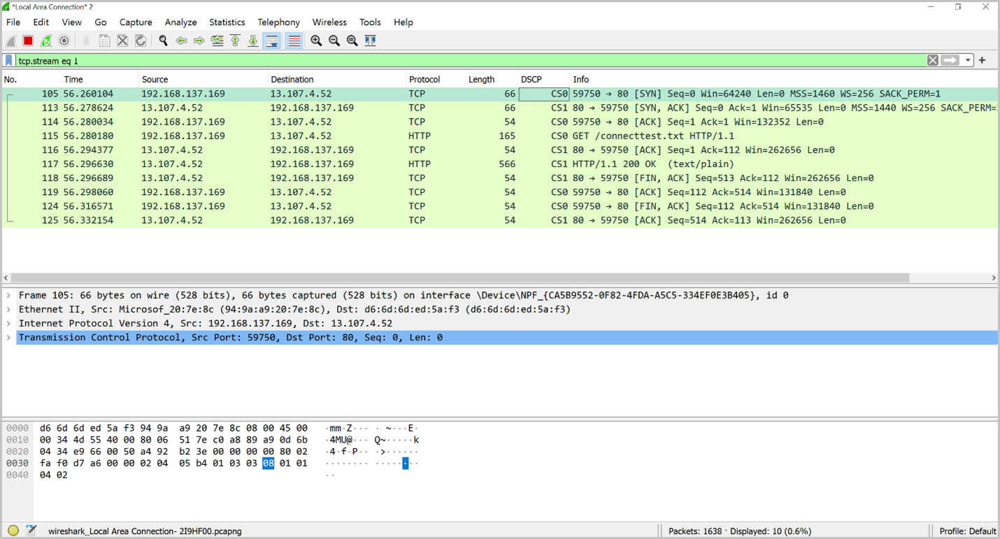

# Diagnose HoloLens 2 network issues with Fiddler and Wireshark

If network issues are an obstacle to successfully deploying and using HoloLens 2 in your organization, learn how two well-known network diagnostic tools, Fiddler and Wireshark can help you scan, diagnose, and identify problems.

[Fiddler](https://www.telerik.com/fiddler) is a web debugging proxy and is used to troubleshoot HTTP(S) issues. It captures every HTTP request the computer makes and records everything associated with it, uncovering end-user authentication issues for the HTTPS apps used in your organization.  Fiddler drives better productivity and efficiency for your HoloLens 2 use cases.

[Wireshark](https://www.wireshark.org/) is a network protocol analyzer primarily used to inspect TCP/UDP traffic from and to your HoloLens 2 devices. This makes it easy to identify what traffic is crossing your network to your HoloLens 2, how much of it, how frequently, how much latency there is between certain hops, etc.

We’ll go over some examples of when to use these tools, along with installing and configurations with your HoloLens 2.

## Fiddler

Let's say you have an authentication issue with a custom line of business (LOB) application. After being installed on your HoloLens 2, the app can't authenticate to the back-end server through HTTPS. To troubleshoot this, you can use Fiddler to capture and decode the HTTPS sessions, enabling discovery of network level-issues.

### Configure Fiddler to capture HTTP traffic from HoloLens 2

#### Prerequisites:

* HoloLens 2 devices and your PC must be on the same network
* Note the IP address of your PC

#### Steps:

On your PC, install and start Fiddler. Configure Fiddler to allow remote computers to connect:

1. Go to Fiddler **Settings** and select **Connections**.
1. Note the listening port for Fiddler (the default is 8866).
1. Select **Allow remote computers to connect**.

   

1. Select **Save**.

On your HoloLens 2, configure Fiddler as the proxy server*:

1. Open the Start menu and select **Settings**.
1. Select **Network & Internet** and then **Proxy** on the left menu.
1. Scroll down to **Manual proxy setup** and toggle **Use a proxy server** to **On**.
1. Enter the IP address of the PC where Fiddler is installed.
1. Enter the port number noted above (default is 8866).
1. Select **Save**.

\* If your HoloLens 2 devices is running Windows Holographic builds 20279.1006 and later (Insiders and the upcoming release), use the following steps to configure proxy:

1. Open the **Start** menu and go to your Wi-Fi network’s **Properties** page.
1. Scroll down to **Proxy**.
1. Change to **Manual Setup**.
1. Enter the IP address of the PC where Fiddler is installed.
1. Enter the port number noted above. (default is 8866).
1. Select **Apply**.

### Decrypt HTTPS traffic from HoloLens 2

On your PC, export the Fiddler certificate.

1. Go to Fiddler **Settings** > HTTPS and expand **Advanced Settings**.
1. Select **Export Fiddler certificate**. The certificate will save to your desktop.

    

3. Move the certificate to the **Downloads** folder on your HoloLens 2.

On your HoloLens 2, import the Fiddler certificate.

1. Go to **Settings > Update and Security > Certificates**.
2. Select **Install Certificate**, browse to the **Downloads** folder and select the Fiddler certificate.
3. Change **Store Location** to **Local Machine**.
4. Change **Certificate Store** to **root**.
5. Select **Install**.
6. Confirm the certificate is showing in the list of certificates. If not, repeat the above steps.

### Inspect HTTP(S) sessions

On your PC, Fiddler will show the HoloLens 2’s live HTTP(S) sessions. The Inspectors panel in Fiddler can show HTTP(S) request/response in different views - for example, the “Raw” view shows the raw request or response in plain text.

## Wireshark

Applications like Dynamics 365 Remote Assist and VPN plug-ins use non-HTTPS traffic. If your HoloLens 2 has any issues with those types of apps, Wireshark can be used to capture and inspect the IP traffic to troubleshoot your internal OS level networking stack.

### Configure Wireshark to capture network traffic from HoloLens 2

#### Prerequisites:

Your PC must have internet access and support Internet sharing over Wi-Fi.

#### Steps:

On your PC:

1. Install Wireshark.
1. In **Mobile hotspot** settings, turn **Share my Internet connection with other devices** to **On**.

    

1. Start Wireshark and capture traffic from the Mobile hotspot interface.

    

On your HoloLens 2, change the Wi-Fi network to the PC’s mobile hotspot. HoloLens 2 IP traffic will now show up in Wireshark.

### Analyze Wireshark logs

Wireshark filters can help filtering out the packets of interests. For example, “tcp.stream eq 1” shows the second TCP stream in the log (stream index starts with 0), “ip.addr == 192.168.137.1 && tcp.port == 80” filters out the TCP packets on port 80 with source/destination IP equals 192.168.137.1.

## Conclusion

After deploying HoloLens 2 to your organization, you may need to capture network traffic for troubleshooting purposes. Both Fiddler and Wireshark will work with the HoloLens 2 to identify and diagnose problems in the HTTP(S) and TCP/UDP levels.

### Feedback Hub and troubleshooting tips

HoloLens 2 provides a few methods for users to provide diagnostic logs to Microsoft for investigation. You can use Feedback Hub to submit logs for generic network connectivity issues by submitting your feedback through the “Network & Internet” category. In addition, the built-in Settings Troubleshooter can collect detailed network traces for more complex issues. For more information, see [Collect and use diagnostic information from HoloLens devices](hololens-diagnostic-logs.md) for instructions.
