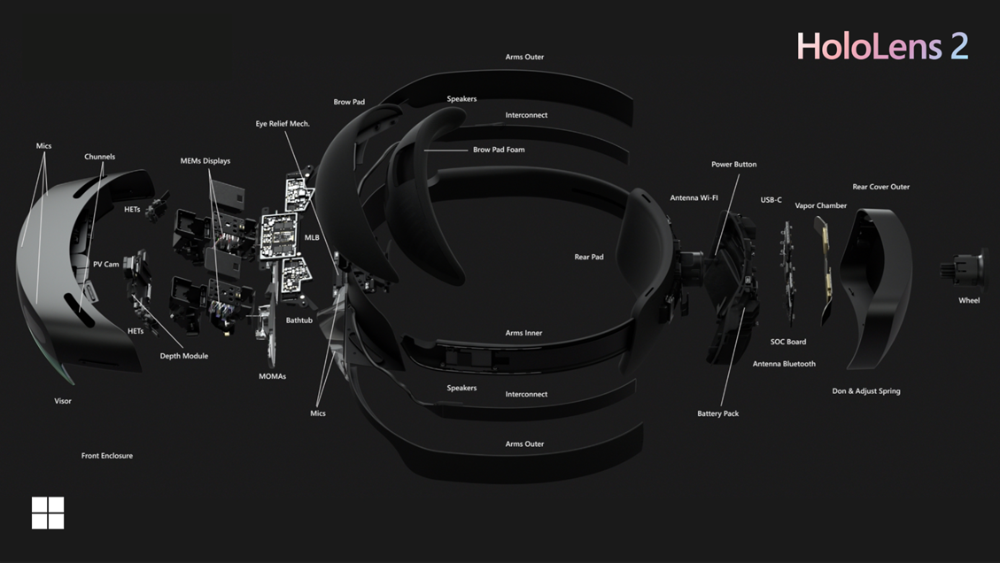
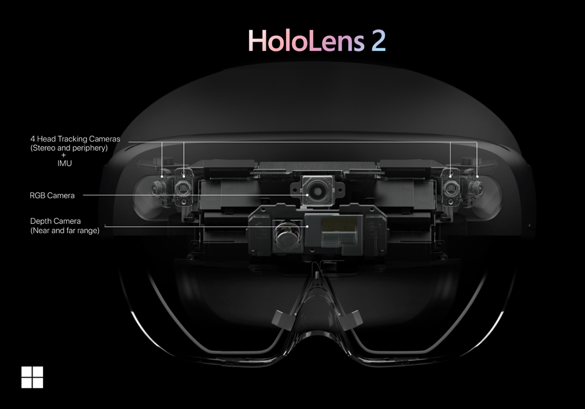

# HoloLens 2 hardware

Microsoft HoloLens 2 is an untethered holographic computer.  It refines the holographic computing journey started by HoloLens (1st gen) to provide a more comfortable and immersive experience paired with more options for collaborating in mixed reality.

## HoloLens components

- **Visor**. Contains the HoloLens sensors and displays. You can rotate the visor up while wearing the HoloLens.
- **Headband**. To put the HoloLens on, use the adjustment wheel to expand the headband. With the HoloLens in place, tighten the adjustment wheel by turning to the right, until the headband is comfortable.
- **Brightness buttons**. When wearing the HoloLens, the brightness buttons are on the left side of the device.
- **Volume buttons**. When wearing the HoloLens, the volume buttons are on the right side of the device.

## In the box

- **Brow pad**. You can remove and replace the brow pad, as needed.
- **Overhead strap**. When you're wearing the HoloLens while moving around, use the overhead strap to help keep the device in place. When wearing the HoloLens for extended periods, the overhead strap may make the device more comfortable to wear.
- **USB-C cable**. Use the USB-C cable to connect your HoloLens to the power supply for charging, or to connect your HoloLens to your computer.
- **Power supply**. Plugs into a power outlet.
- **Microfiber cloth**. Use to clean your HoloLens visor.

### Power Supply details

The power supply and the USB cable that come with the device are the best supported mechanism for charging. The power supply is an 18W charger.  It's supplies 9V at 2A.

Charging rate and speed may vary depending on the environment in which the device is running.

In order to maintain/advance Internal Battery Charge Percentage while the device is on, it must be connected minimum to a 15W charger.

## Device specifications

### Display

|   |   |
| - | - |
| Optics | See-through holographic lenses (waveguides) |
| Holographic resolution | 2k 3:2 light engines |
| Holographic density | >2.5k radiants (light points per radian) |
| Eye-based rendering | Display optimization for 3D eye position |

### Sensors

|   |   |
| - | - |
| Head tracking | 4 visible light cameras |
| Eye tracking | 2 Infrared (IR) cameras |
| Depth | 1-MP Time-of-Flight depth sensor |
| Inertial measurement unit (IMU) | Accelerometer, gyroscope, magnetometer |
| Camera | 8-MP stills, 1080p30 video |

> [!NOTE]
> Do no cover any of the sensors that are called out in the picture. The head tracking cameras have a very wide FOV, nothing should be around them in addition to not covering them.

### Audio and speech

|   |   |
| - | - |
| Microphone array | 5 channels |
| Speakers | Built-in spatial sound |

### Compute and connectivity

|   |   |
| - | - |
| System on chip | Qualcomm Snapdragon 850 Compute Platform [details](https://www.qualcomm.com/products/snapdragon-850-mobile-compute-platform) |
| Holographic processing unit | Second-generation custom-built holographic processing unit |
| Memory | 4-GB LPDDR4x system DRAM |
| Storage | 64-GB UFS 2.1 |
| WiFi | 802.11ac 2x2 |
| Bluetooth | 5.0 |
| USB | USB Type-C |

### Power

|   |   |
| - | - |
| Battery Life | 2-3 hours of active use. Up to 2 weeks of standby time. |
| Battery technology | [Lithium batteries](https://www.microsoft.com/download/details.aspx?id=43388) |
| Charging behavior | Fully functional when charging |
| Cooling type | Passively cooled (no fans) |
| Power draw | In order to maintain/advance Internal Battery Charge Percentage while the device is on, it must be connected minimum to a 15W charger. |

### Fit

|   |   |
| - | - |
| Sizing | Single size with adjustable band.  Fits over eyeglasses |
| Weight | 566 grams |

## Device capabilities

### Human understanding

|   |   |
| - | - |
| Hand tracking | Two-handed fully articulated model, direct manipulation |
| Eye tracking | Real-time tracking |
| Voice | Command and control on-device; Cortana natural language with internet connectivity |

### Environment understanding

|   |   |
| - | - |
| Six Degrees of Freedom (6DoF) tracking | World-scale positional tracking |
| Spatial mapping | Real-time environment mesh |
| Mixed reality capture | Mixed hologram and physical environment photos and videos |

## Pre-installed software

- Windows Holographic Operating System
- 3D Viewer
- Calendar
- Cortana
- Dynamics 365 Guides
- Dynamics 365 Remote Assist
- Feedback Hub
- File Explorer
- Mail
- Microsoft Edge
- Microsoft Store
- Movies & TV
- OneDrive
- Photos
- Settings
- Tips

## Device certifications

### Safety

* [Product Safety](https://support.microsoft.com/en-us/help/4023454/safety-information)
* [Product Safety Warnings and Instructions](https://support.microsoft.com/en-us/help/4558037/product-safety-warnings-and-instructions)
* Eye safety: HoloLens 2 has been tested and conforms to the basic impact protection requirements of ANSI Z87.1, CSA Z94.3 and EN 166.
* [SAR Information](https://support.microsoft.com/help/12673/mobile-devices-sar-information)

### Regulatory information
[HoloLens Regulatory](https://support.microsoft.com/en-us/help/13761/hololens-regulatory-information): Includes information on temperature, disposal, radio and TV interference, and more.

## Package Dimensions

|      Measurement               |      Units metric     |      Units imperial     |
|--------------------------------|-----------------------|-------------------------|
|     Unit Length                |     378.97mm          |     14.920 inches       |
|     Unit Width                 |     247.90mm          |     9.760 inches        |
|     Unit Depth                 |     163.07mm          |     6.420 inches        |
|     Unit Weight                |     2.878kg           |     6.344 lbs           |
|     Exterior Shipper Length    |     446.00mm          |     17.559 inches       |
|     Exterior Shipper Width     |     257.99mm          |     10.157 inches       |
|     Exterior Shipper Depth     |     172.01mm          |     6.772 inches        |
|     Exterior Shipper Weight    |     3.284kg           |     7.240 lbs           |

Notes:
- Unit: The black, retail-style box HoloLens 2 is sold in.
- Exterior Shipper: The protective shipping packaging around Unit.

## Finding the Serial number

The serial number for HoloLens 2 devices is printed underneath the visor.
1. Lift the visor of the device up.
1. Look near the the brow pad.
1. You can find the serial number located close to the hinge. 

The serial number can also be found via a connected PC:

1. Plug in the device
1. Navigate to **This PC** in file explorer
1. Right Click and select **Properties** of the HoloLens device
1. This will display the series number of the device. Like this screenshot below.

## Next step

> [!div class="nextstepaction"]
> [Set up and start your HoloLens 2](hololens2-setup.md)
