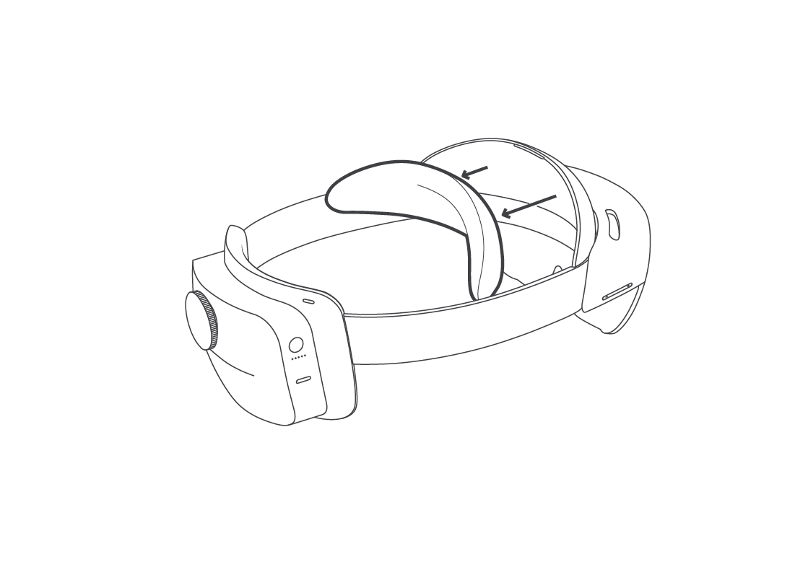

# HoloLens 2 cleaning FAQ

> [!IMPORTANT]  
> Microsoft cannot make a determination of the effectiveness of any given disinfectant product in fighting pathogens such as COVID-19. Please refer to your local public health authority's guidance about how to stay safe from potential infection.  

## HoloLens 2 Use and Care

> [!VIDEO https://channel9.msdn.com/Shows/Docs-Mixed-Reality/HoloLens-2-Use-and-Care/player]

<!-- <iframe src="https://channel9.msdn.com/Shows/Docs-Mixed-Reality/HoloLens-2-Use-and-Care/player" width="960" height="540" allowFullScreen frameBorder="0" title="HoloLens 2 Use and Care - Microsoft Channel 9 Video"></iframe> -->

**To clean the device**

1. Remove any dust by using a dry, lint-free microfiber cloth to gently wipe the surface of the device.
1. Lightly moisten the cloth by using medical "70%" isopropyl alcohol, and then use the moistened cloth to gently wipe the surface of the device.
1. Let the device dry completely.

**To clean the brow pad**

1. Use water and a mild, antibiotic soap to moisten a cloth, and then use the moistened cloth to wipe the brow pad.
1. Let the brow pad dry completely.

## Can I use any lens cleaner for cleaning the HoloLens visor?

No. Lens cleaners can be abrasive to the coatings on the visor. To clean the visor, follow these steps:  

1. Remove any dust by using a dry lint-free microfiber cloth to gently wipe the visor.
1. Lightly moisten a cloth by using medical "70%" isopropyl alcohol, and then gently wipe the visor.
1. Let the visor dry completely.

## Can I use disinfecting wipes to clean the device?

Yes, if the wipes do not contain bleach. You can use non-bleach disinfecting wipes to [gently wipe the HoloLens surfaces](#hololens-2-use-and-care).  

> [!CAUTION]  
> Avoid using disinfecting wipes that contains bleach to clean the HoloLens surfaces. It is acceptable to use bleach wipes in critical situations, when nothing else is available. However, bleach may damage the HoloLens visor or other surfaces.

## Can I use alcohol to clean the device?

Yes. You can use a solution of "70%" isopropyl alcohol and water to clean the hard surfaces of the device, including the visor. Lightly moisten the cloth by using a mix of isopropyl alcohol and water, and then gently wipe the surface of the device

## Is the brow pad replaceable?

Yes. The brow pad is magnetically attached to the device. To detach it, pull it gently away from the headband. To replace it, snap it back into place.

## How can I clean the brow pad?

To clean the brow pad, wipe it by using a cloth that's moistened by using water and a mild antibiotic soap. Let the brow pad dry completely before you use it again.

## Can I use ultraviolet (UV) light to sanitize the device?

UVC irradiance using UVC LED, that operates at 265nm at intensity level of 0.5-0.6mW/cm2, and does not emit ozone, can be used to sanitize HoloLens2. 
Please follow manufacturer’s specifications on handling and exposure time.

> [!CAUTION]  
> High levels of UV-A and UV-B exposure can degrade the display quality of the device and damage the visor coating. Over-exposure to UV-A and UV-B radiation has the following effects, in order of the duration and intensity of exposure:
>  
> 1. The brow pad and device closures become discolored.
> 1. Defects appear in the anti-reflective (AR) coating on the visor and on the sensor windows.
> 1. Defects appear in the base materials of the visor and on the sensor windows.
> 1. Display performance degrades.

## Is the rear pad replaceable?

No.
