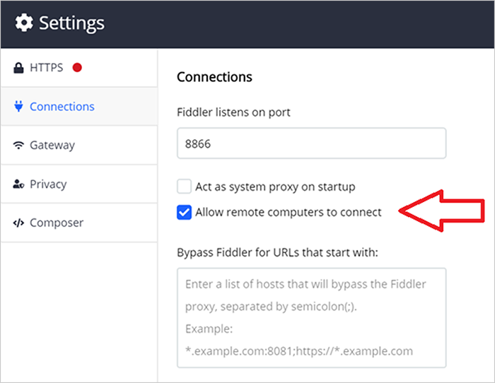
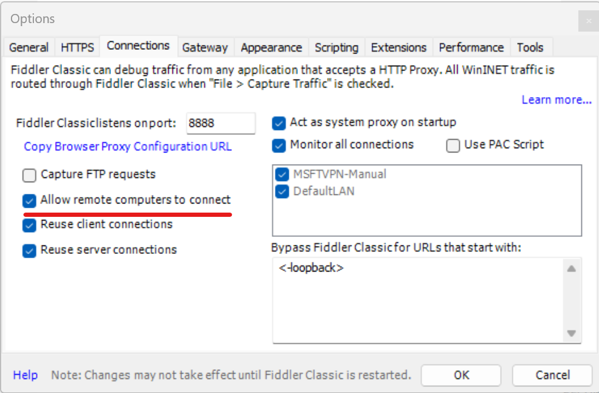
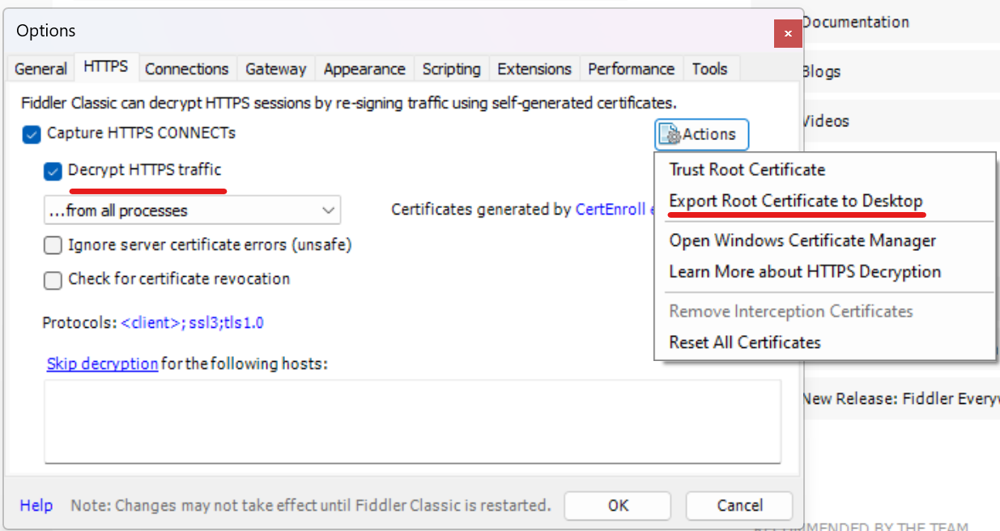
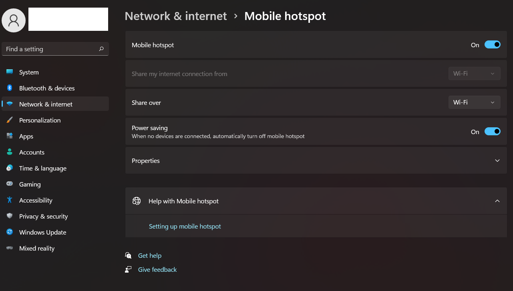

# [Fiddler Everywhere](#tab/everywhere)

## Fiddler Everywhere

Let's say you have an authentication issue with a custom line of business (LOB) application. After being installed on your HoloLens 2, the app can't authenticate to the back-end server through HTTPS. To troubleshoot this, you can use Fiddler to capture and decode the HTTPS sessions, enabling discovery of network level-issues.

### Configure Fiddler to capture HTTP traffic from HoloLens 2

#### Prerequisites:

* HoloLens 2 devices and your PC must be on the same network
* Note the IP address of your PC

#### Steps:

On your PC, install and start Fiddler. Configure Fiddler to allow remote computers to connect:

1. Go to Fiddler **Settings** and select **Connections**.
1. Note the listening port for Fiddler (the default is 8866, and 8888 for Fiddler Classic).
1. Select **Allow remote computers to connect**.

    **Note:** Under **Tools -> Options -> HTTPS**, select capturing **HTTPS Connects/Decrypt** for remote clients only. This way, we won't capture local traffic, but only the traffic coming from the HoloLens.

   

1. Select **Save**.

On your HoloLens 2, configure Fiddler as the proxy server*:

1. Open the Start menu and select **Settings**.
1. Select **Network & Internet** and then **Proxy** on the left menu.
1. Scroll down to **Manual proxy setup** and toggle **Use a proxy server** to **On**.
1. Enter the IP address of the PC where Fiddler is installed.
1. Enter the port number noted above (default is 8866).
1. Select **Save**.

\* If your HoloLens 2 devices is running Windows Holographic builds 20279.1006 and later (Insiders and the upcoming release), use the following steps to configure proxy:

1. Open the **Start** menu and go **Settings -> Network & Internet -> Status -> Wi-Fi network's Properties**.
1. Scroll down to **Proxy**.
1. Change to **Manual Setup**.
1. Enter the IP address of the PC where Fiddler is installed.
1. Enter the port number noted above. (default is 8866).
1. Select **Apply**.

### Decrypt HTTPS traffic from HoloLens 2

On your PC, export the Fiddler certificate.

1. Go to Fiddler **Settings** > HTTPS and expand **Advanced Settings**.
1. Select **Export Fiddler certificate**. The certificate will save to your desktop.

    

3. Move the certificate to the **Downloads** folder on your HoloLens 2.

On your HoloLens 2, import the Fiddler certificate.

1. Go to **Settings > Update and Security > Certificates**.
2. Select **Install Certificate**, browse to the **Downloads** folder and select the Fiddler certificate.
3. Change **Store Location** to **Local Machine**.
4. Change **Certificate Store** to **root**.
5. Select **Install**.
6. Confirm the certificate is showing in the list of certificates. If not, repeat the above steps.

### Inspect HTTP(S) sessions

On your PC, Fiddler will show the HoloLens 2’s live HTTP(S) sessions. The Inspectors panel in Fiddler can show HTTP(S) request/response in different views - for example, the “Raw” view shows the raw request or response in plain text.

# [Fiddler Classic](#tab/classic)

## Fiddler Classic

Let's say you have an authentication issue with a custom line of business (LOB) application. After being installed on your HoloLens 2, the app can't authenticate to the back-end server through HTTPS. To troubleshoot this, you can use Fiddler to capture and decode the HTTPS sessions, enabling discovery of network level-issues.

### Configure Fiddler to capture HTTP traffic from HoloLens 2

#### Prerequisites:

* HoloLens 2 devices and your PC must be on the same network
* Note the IP address of your PC

#### Steps:

On your PC, install and start Fiddler. Configure Fiddler to allow remote computers to connect:

1. Go to Fiddler **Settings** and select **Connections**.
1. Note the listening port for Fiddler (the default is 8866, and 8888 for Fiddler Classic).
1. Select **Allow remote computers to connect**.

    **Note:** Under **Tools -> Options -> HTTPS**, select capturing **HTTPS Connects/Decrypt** for remote clients only. This way, we won't capture local traffic, but only the traffic coming from the HoloLens.

   

1. Select **Save**.

On your HoloLens 2, configure Fiddler as the proxy server*:

1. Open the Start menu and select **Settings**.
1. Select **Network & Internet** and then **Proxy** on the left menu.
1. Scroll down to **Manual proxy setup** and toggle **Use a proxy server** to **On**.
1. Enter the IP address of the PC where Fiddler is installed.
1. Enter the port number noted above (default is 8866).
1. Select **Save**.

\* If your HoloLens 2 devices is running Windows Holographic builds 20279.1006 and later (Insiders and the upcoming release), use the following steps to configure proxy:

1. Open the **Start** menu and go **Settings -> Network & Internet -> Status -> Wi-Fi network's Properties**.
1. Scroll down to **Proxy**.
1. Change to **Manual Setup**.
1. Enter the IP address of the PC where Fiddler is installed.
1. Enter the port number noted above. (default is 8866).
1. Select **Apply**.

### Decrypt HTTPS traffic from HoloLens 2

On your PC, export the Fiddler certificate.

1. Go to Fiddler **Settings** > HTTPS and expand **Advanced Settings**.
1. Select **Export Fiddler certificate**. The certificate will save to your desktop.

    

3. Move the certificate to the **Downloads** folder on your HoloLens 2.

On your HoloLens 2, import the Fiddler certificate.

1. Go to **Settings > Update and Security > Certificates**.
2. Select **Install Certificate**, browse to the **Downloads** folder and select the Fiddler certificate.
3. Change **Store Location** to **Local Machine**.
4. Change **Certificate Store** to **root**.
5. Select **Install**.
6. Confirm the certificate is showing in the list of certificates. If not, repeat the above steps.

### Inspect HTTP(S) sessions

On your PC, Fiddler will show the HoloLens 2’s live HTTP(S) sessions. The Inspectors panel in Fiddler can show HTTP(S) request/response in different views - for example, the “Raw” view shows the raw request or response in plain text.

# [Wireshark](#tab/wireshark)

## Wireshark

Applications like Dynamics 365 Remote Assist and VPN plug-ins use non-HTTPS traffic. If your HoloLens 2 has any issues with those types of apps, Wireshark can be used to capture and inspect the IP traffic to troubleshoot your internal OS level networking stack.

### Configure Wireshark to capture network traffic from HoloLens 2

#### Prerequisites:

Your PC must have internet access and support Internet sharing over Wi-Fi.

#### Steps:

On your PC:

1. Install Wireshark.
1. In **Mobile hotspot** settings, turn **Share my Internet connection with other devices** to **ON**.

    

1. Start Wireshark and capture traffic from the Mobile hotspot interface.

    

On your HoloLens 2, change the Wi-Fi network to the PC’s mobile hotspot. HoloLens 2 IP traffic will now show up in Wireshark.

>[!Note]
>Turning Wi-Fi hotspot ON will create a new local area network connection with Microsoft Wi-Fi Direct Virtual Adapter.

### Analyze Wireshark logs

Wireshark filters can help filtering out the packets of interests. For example, “tcp.stream eq 1” shows the second TCP stream in the log (stream index starts with 0), “ip.addr == 192.168.137.1 && tcp.port == 80” filters out the TCP packets on port 80 with source/destination IP equals 192.168.137.1.

