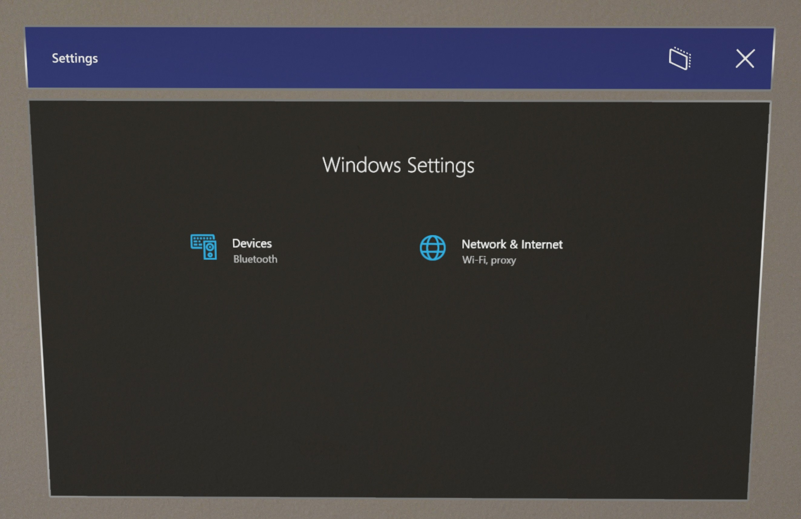

# Settings URIs

One of the manageable features for HoloLens devices is using the [Settings/PageVisibilityList policy](https://docs.microsoft.com/windows/client-management/mdm/policy-csp-settings#settings-pagevisibilitylist) to restrict the pages seen within the Settings app. PageVisibilityList is a policy that allows IT Admins to either prevent specific pages in the System Settings app from being visible or accessible, or to do so for all pages except those specified. 

> [!IMPORTANT]
> This feature is currently only avalible in [Windows Insider builds](hololens-insider.md). Please ensure devices you intend to use this for are on build 19041.1349+.

The following example illustrates a policy that would allow access only to the about and bluetooth pages, which have URI "ms-settings:network-wifi" and "ms-settings:bluetooth" respectively:
- showonly:network-wifi;network-proxy;bluetooth

To set this via a Provsioning Package: 
1. While creating your package in Windows Configuration Designer navigate to **Policies > Settings > PageVisibilityList**
1. Enter the string: **showonly:network-wifi;network-proxy;bluetooth**
1. Export your Provsioning Package.
1. Apply the package to your device. 
For full details on how to create and apply a provsioning package visit [this page](hololens-provisioning.md). 

This can be done via Intune using OMA-URI.
1. Create a **Custom policy**.
1. When setting the OMA-URI use the string: **./Device/Vendor/MSFT/Policy/Config/Settings/PageVisibilityList**
1. When selecting the data pick choose: **String**
1. When typing the value use: **showonly:network-wifi;network-proxy;bluetooth**
1. Make sure to assign the custom device configuration to the a group the device is intended to be in.
For more information on Intune groups and device configurations [visit here](hololens-mdm-configure.md).

Regardless of method choosen your device should now receive the changes and users will be presented with the following Settings App. 

To configure the Settings app pages to show or hide your own selection of pages, please take a look at the Settings URIs avalible on HoloLens. 

## Settings URIs

HoloLens devices and Windows 10 devices have a different selection of pages within the Settings app. On this page you will find only the settings that exist on HoloLens. 

### Accounts
| Settings page           | URI                                            |
|-------------------------|------------------------------------------------|
| Sign In Options         | ms-settings:signinoptions                      |
| Iris Enrollment       | ms-settings:signinoptions-launchirisenrollment |
| Access work or school | ms-settings:workplace                          |

### Devices
| Settings page | URI                          |
|---------------|------------------------------|
| Bluetooth     | ms-settings:bluetooth   ms-settings:connecteddevices |

### Privacy
| Settings page            | URI                                             |
|--------------------------|-------------------------------------------------|
| Account Info             | ms-settings:privacy-accountinfo                 |
| App Diagnostics        | ms-settings:privacy-appdiagnostics              |
| Background Apps        | ms-settings:privacy-backgroundapps              |
| User movements           | ms-settings:privacy-backgroundspatialperception |
| File system              | ms-settings:privacy-broadfilesystemaccess       |
| Calendar                 | ms-settings:privacy-calendar                    |
| Call History             | ms-settings:privacy-callhistory                 |
| Contacts                 | ms-settings:privacy-contacts                    |
| Other devices            | ms-settings:privacy-customdevices               |
| Documents                | ms-settings:privacy-documents                   |
| Email                    | ms-settings:privacy-email                       |
| Diagnostics & Feedback | ms-settings:privacy-feedback                    |
| Location                 | ms-settings:privacy-location                    |
| Messaging                | ms-settings:privacy-messaging                   |
| Microphone               | ms-settings:privacy-microphone                  |
| Notifications            | ms-settings:privacy-notifications               |
| Pictures                 | ms-settings:privacy-pictures                    |
| Radios                   | ms-settings:privacy-radios                      |
| Speech                   | ms-settings:privacy-speech                      |
| Tasks                    | ms-settings:privacy-tasks                       |
| Videos                   | ms-settings:privacy-videos                      |
| Voice Activation       | ms-settings:privacy-voiceactivation             |
| Camera                   | ms-settings:privacy-webcam                      |

### Network & Internet
| Settings page | URI                              |
|---------------|----------------------------------|
| Wi-Fi  | ms-settings:network-wifi ms-settings:network-wifisettings ms-settings:network-status ms-settings:wifi-provisioning    |
| VPN   | ms-settings:network-vpn          |
| Proxy | ms-settings:network-proxy        |

### System
| Settings page      | URI                                |
|--------------------|------------------------------------|
| Shared Experiences | ms-settings:crossdevice            |
| Colors             | ms-settings:colors ms-settings:personalization-colors |
| Notifications & actions  | ms-settings:notifications          |
| Storage            | ms-settings:storagesense           |

### Time & Language
| Settings page | URI                                           |
|---------------|-----------------------------------------------|
| Region        | ms-settings:regionformatting                  |
| Language      | ms-settings:regionlanguage ms-settings:regionlanguage-adddisplaylanguage ms-settings:regionlanguage-setdisplaylanguage |

### Update & Security
| Settings page                         | URI                                       |
|---------------------------------------|-------------------------------------------|
| Windows Insider Program               | ms-settings:windowsinsider  ms-settings:windowsinsider-optin          |
| Windows Update                        | ms-settings:windowsupdate  ms-settings:windowsupdate-activehours    ms-settings:windowsupdate-history   ms-settings:windowsupdate-optionalupdates  1ms-settings:windowsupdate-options 1ms-settings:windowsupdate-restartoptions |
| Windows Update - Checks for updates | ms-settings:windowsupdate-action          |
| Advanced Options                    | ms-settings:windowsupdate-options         |

> [!NOTE]
>  1 The following two URI do not actually take you to the Advanced options or Options page, they will only block / show the main Windows Update page. 
> - ms-settings:windowsupdate-options
> - ms-settings:windowsupdate-restartoptions 

For a full list of Windows 10 Settings URIs, please visit [here](https://docs.microsoft.com/windows/uwp/launch-resume/launch-settings-app#ms-settings-uri-scheme-reference). 
